# Financial Analysis Control Room

Human-in-the-loop orchestration platform for supervised financial anomaly review, combining deterministic workflow control, optional LLM-assisted planner reasoning, controlled tool calling, Python-based anomaly detection, structured financial analysis, MCP regulatory retrieval, real-time telemetry, and human approval gates.

This repository is best described as a **controlled LLM-assisted human-in-the-loop orchestration platform**. LLM reasoning is advisory, workflow control remains deterministic, and human approval remains mandatory.

## Current AI Status

This project now supports **optional controlled LLM-assisted planner reasoning** and **controlled tool calling**.

The LLM is used to generate structured reasoning summaries and, when enabled, propose tool calls for the `PlannerAgent`. It does not control workflow transitions, approve or reject sessions, execute tools autonomously, or make legal/financial decisions.

Current implementation:

- `PlannerAgent` coordinates the workflow in .NET.
- `PlannerAgent` can optionally use Semantic Kernel + OpenAI for advisory reasoning summaries.
- `PlannerAgent` can optionally ask the LLM to propose read-only tool calls.
- Proposed tool calls are normalized, validated against an allowlist, and audited.
- In `Shadow` mode, tool calls are not dynamically executed by the workflow.
- In `PlanDriven` mode, approved read-only tool calls can execute through a controlled executor.
- If LLM reasoning is disabled or fails, the system falls back to deterministic planner reasoning.
- `DataAgent` runs Python-based anomaly detection through Semantic Kernel + CSnakes.
- `DataAgent` can optionally run structured financial analysis with Python/Pandas through CSnakes.
- `LegalAgent` retrieves cited CNV regulatory evidence through Semantic Kernel + MCP.
- The workflow pauses for human approval when risk is detected.
- All activity is streamed in real time and persisted for audit review.

The architecture is intentionally designed so LLM-backed reasoning and tool proposals can assist the workflow without bypassing the state machine, HITL controls, MCP evidence retrieval, Python analytics, or audit trail.

## Controlled LLM Planner Reasoning

The `PlannerAgent` can optionally use an LLM through Semantic Kernel to generate structured reasoning summaries.

The LLM output is advisory only.

The LLM cannot:

- approve an analysis session,
- reject an analysis session,
- complete a workflow,
- fail a workflow,
- bypass human approval,
- directly or autonomously execute tools,
- override the state machine.

If LLM reasoning is disabled or fails, the system uses deterministic planner reasoning. The state machine and HITL approval gates remain mandatory.

Planner reasoning metadata is persisted in `ContextJson`, including:

- engine,
- summary,
- recommended actions,
- risk factors,
- limitations,
- whether LLM reasoning was used,
- whether deterministic fallback was used,
- provider,
- model,
- safe fallback reason when applicable.

No API keys, stack traces, or secrets are persisted.

## Controlled Tool Calling

The LLM can now propose tool calls, but every proposed call is normalized, validated against an allowlist, optionally executed through a controlled executor, audited, and still constrained by deterministic workflow state and mandatory human approval.

Controlled tool calling has two execution modes:

- `Shadow`: proposed calls are normalized, validated, and audited, but the existing deterministic `DataAgent` and `LegalAgent` path remains the source of workflow evidence.
- `PlanDriven`: proposed and approved calls are executed through `ControlledToolExecutor`; execution outputs are mapped back into `DataAgentResult` and `LegalAgentResult`.

`Shadow` is the default mode.

Current core allowlist:

- `data.analyze_transactions`: read-only statistical anomaly analysis owned by `DataAgent`.
- `legal.search_cnv_regulation`: read-only CNV regulatory retrieval owned by `LegalAgent` / MCP.

Optional financial-analysis tools are available for controlled execution when `ToolCalling__FinancialAnalysisToolsEnabled=true`:

- `data.compute_financial_ratios`
- `data.compare_periods`
- `data.detect_financial_risk_signals`
- `data.summarize_quantitative_evidence`

These tools are read-only, auditable, and cannot modify workflow state, approve sessions, reject sessions, move money, or block accounts.

Tool-calling pipeline:

```text
PlannerAgent
  -> IToolPlanProposalService
      -> DeterministicToolPlanProposalService
      OR
      -> SemanticKernelToolPlanProposalService
          -> Semantic Kernel
          -> OpenAI chat completion
          -> defensive JSON parsing
          -> deterministic fallback on failure
  -> ToolPlanNormalizer
  -> ToolPlanValidator
  -> ToolExecutionPolicy
  -> ControlledToolExecutor optional, PlanDriven only
  -> ToolExecutionResultMapper
  -> PlannerReasoningService
  -> deterministic HITL decision
```

Guardrails:

- unknown tools are rejected,
- workflow transition tools are rejected,
- approval/rejection tools are rejected,
- operational financial tools are rejected,
- legal conclusion tools are rejected,
- duplicate calls are normalized before validation,
- max tool-call count is capped,
- `OutputJson` is not persisted in `ContextJson`,
- failed or unmappable executions fall back to the deterministic agent path.

Rejected examples:

- `workflow.complete`
- `workflow.fail`
- `approval.approve_session`
- `approval.reject_session`
- `money.move`
- `account.freeze`
- `transaction.block`
- `legal.determine_violation`
- `legal.issue_advice`
- `system.execute_command`
- `database.raw_query`

### Shadow Mode

In `Shadow` mode, the workflow still runs:

```text
PlannerAgent
  -> DataAgent
  -> LegalAgent
  -> PlannerReasoning
  -> Tool plan proposal / validation / audit
  -> HITL decision
```

Approved tool calls are marked as execution-policy decisions such as `SkippedAlreadySatisfied` when the deterministic agent path already produced the evidence.

### PlanDriven Mode

In `PlanDriven` mode, the workflow runs:

```text
PlannerAgent
  -> Tool plan proposal
  -> Normalization
  -> Validation
  -> Controlled execution of approved read-only tools
  -> Map execution outputs to DataAgentResult / LegalAgentResult
  -> PlannerReasoning
  -> deterministic HITL decision
```

Only allowlisted tools can execute. The LLM never receives authority to transition workflow state or make approval decisions.

Legal mapping keeps the regulatory retrieval boundary intact:

- uncited MCP results do not become `LegalEvidence`,
- MCP warnings are propagated,
- review disclaimers are preserved,
- evidence is described as regulatory retrieval evidence,
- the system does not claim a legal violation.

### Development Diagnostics

Development-only endpoint:

```text
POST /api/diagnostics/tool-calling/execute
```

It validates a proposed plan, applies execution policy, optionally executes approved calls when `dynamicExecutionEnabled=true`, and returns proposed, approved, rejected, and executed calls.

It does not create or mutate `AnalysisSession` records and does not touch the state machine.

## What This Project Is

This is a human-supervised orchestration platform for financial analysis workflows.

It demonstrates how to combine:

- deterministic workflow orchestration,
- specialized agents,
- Python analytics,
- regulatory retrieval via MCP,
- human approval gates,
- real-time activity streaming,
- persisted audit history.

## What This Project Is Not Yet

This project does **not** currently include:

- autonomous LLM tool-calling,
- unrestricted tool execution,
- LLM-controlled workflow transitions,
- autonomous legal interpretation,
- universal PDF extraction, OCR, or visual table parsing,
- LLM-based financial metric extraction,
- natural language report understanding,
- automatic financial decision-making,
- production-grade regulatory advice.

The PlannerAgent may use an LLM for advisory reasoning summaries and controlled tool proposals only.

The LegalAgent retrieves regulatory evidence. It does not provide legal conclusions.
The DataAgent detects statistical anomalies and optional financial risk signals from structured metrics. It does not make operational decisions.
The human auditor remains responsible for approval or rejection.

## Architecture Overview

```text
React Dashboard
  | HTTP + SignalR
  v
ASP.NET Core API
  |
  |-- AnalysisSession State Machine
  |-- Human Approval Endpoints
  |-- SignalR ActivityHub
  |-- ActivityEvents Persistence
  |
  |-- PlannerAgent
        |
        |-- Planner Reasoning
        |     |-- Deterministic fallback
        |     |-- Semantic Kernel + OpenAI optional
        |
        |-- Controlled Tool Calling
        |     |-- Tool plan proposal
        |     |-- ToolPlanNormalizer
        |     |-- ToolPlanValidator allowlist
        |     |-- ToolExecutionPolicy
        |     |-- ControlledToolExecutor PlanDriven optional
        |     |-- ToolExecutionResultMapper
        |
        |-- DataAgent
        |     |-- ConfigurableDataAgent
        |     |     |-- legacy SemanticKernelDataAgent
        |     |     |     |-- PythonAnomalyDetectionPlugin
        |     |     |     |-- CSnakesDataAgent
        |     |     |     |-- Python anomaly_detection.py
        |     |     |
        |     |     |-- DataAgentFinancialAnalysisWorkflow optional
        |     |           |-- StructuredFinancialMetricsProvider
        |     |           |-- IPythonFinancialAnalysisService
        |     |           |-- CSnakesFinancialAnalysisService
        |     |           |-- Python financial_analysis.py
        |     |           |-- Pandas / NumPy
        |     |           |-- FinancialAnalysisContext
        |     |           |-- DataAgentResult
        |
        |-- LegalAgent
              |-- Semantic Kernel
              |-- LegalCompliancePlugin
              |-- MCP stdio client
              |-- CNV Regulation MCP Server
              |-- cnv_regulation PostgreSQL DB

PostgreSQL
  |-- orchestrationdb
  |-- cnv_regulation
```

## Agents

### PlannerAgent

Current implementation: deterministic .NET workflow coordinator with optional controlled LLM-assisted reasoning.

Responsibilities:

- starts the analysis workflow,
- delegates anomaly detection to the DataAgent,
- delegates regulatory evidence retrieval to the LegalAgent,
- combines agent results,
- generates a planner reasoning summary,
- proposes, normalizes, validates, and audits controlled tool calls when enabled,
- executes approved read-only tools only in `PlanDriven` mode,
- decides whether human approval is required through deterministic rules,
- updates workflow state.

Current reasoning behavior:

```text
PlannerAgent
  -> IPlannerReasoningService
      -> DeterministicPlannerReasoningService
      OR
      -> SemanticKernelPlannerReasoningService
          -> Semantic Kernel
          -> OpenAI chat completion
          -> defensive JSON parsing
          -> deterministic fallback on failure
```

The `PlannerAgent` does not allow the LLM to approve, reject, complete, fail, or transition a workflow state.

Current tool-calling behavior:

```text
PlannerAgent
  -> IToolPlanProposalService
  -> ToolPlanNormalizer
  -> ToolPlanValidator
  -> ToolExecutionPolicy
  -> ControlledToolExecutor only when ExecutionMode=PlanDriven
```

The final HITL decision remains deterministic:

```text
requiresHumanApproval =
  dataResult.HasAnomaly ||
  legalResult.HasComplianceRisk
```

### DataAgent

Current implementation: configurable Python analytics path.

By default, the DataAgent uses the legacy Semantic Kernel anomaly-detection path.

When `DataAgent__FinancialAnalysisToolsEnabled=true`, it can run the structured financial-analysis workflow.

Pipeline:

```text
DataAgent
  -> ConfigurableDataAgent
      -> legacy SemanticKernelDataAgent
      OR
      -> DataAgentFinancialAnalysisWorkflow
          -> StructuredFinancialMetricsProvider
          -> IPythonFinancialAnalysisService
          -> CSnakesFinancialAnalysisService
          -> financial_analysis.py
          -> Pandas / NumPy
          -> IDataAgentAiReviewService optional advisory review
          -> FinancialAnalysisContext
          -> DataAgentResult
```

The DataAgent returns backward-compatible anomaly evidence, including metrics, thresholds, severity, and explanation. When structured financial analysis is enabled, it also exposes richer `financialAnalysis` context with ratios, period comparisons, risk signals, risk evidence, warnings, limitations, and optional advisory `aiReview`.

### LegalAgent

Current implementation: Semantic Kernel plugin layer over MCP regulatory retrieval.

Pipeline:

```text
LegalAgent
  -> Semantic Kernel
  -> LegalCompliancePlugin
  -> McpRegulatoryKnowledgeSource
  -> CnvRegulationStdioMcpClient
  -> CnvRegulation.McpServer
  -> cnv_regulation PostgreSQL database
```

LegalAgent AI review can be backed by Semantic Kernel when enabled, but it is constrained to advisory review over provided FinancialAnalysis and CNV/Infoleg evidence. The deterministic fallback remains the safe default.


## Workflow States

The workflow is controlled by a strict state machine.

```text
Pending
  -> DataGathering
  -> AwaitingHumanApproval
  -> Completed

Pending
  -> DataGathering
  -> AwaitingHumanApproval
  -> Failed
```

Main states:

- `Pending`: analysis session was created.
- `DataGathering`: agents are collecting evidence.
- `AwaitingHumanApproval`: workflow is paused and requires human decision.
- `Completed`: human auditor approved the workflow.
- `Failed`: human auditor rejected the workflow or the workflow failed.

The system does not allow risky workflows to complete without explicit human approval.

## Human-in-the-Loop Safety Model

The system is intentionally designed to avoid fully autonomous operational decisions.

When the DataAgent or LegalAgent detects risk:

1. the workflow transitions to `AwaitingHumanApproval`,
2. evidence is persisted in PostgreSQL,
3. activity events are streamed to the React dashboard,
4. the approval panel is displayed,
5. a human auditor must approve or reject the session.

The system only moves to `Completed` after explicit approval.
If rejected, the session moves to `Failed`.

## Auditability

The platform persists:

- analysis sessions,
- current workflow state,
- planner reasoning summaries,
- LLM/fallback metadata,
- proposed, approved, rejected, and execution-audited tool calls,
- agent evidence,
- structured financial-analysis context,
- financial risk signals and quantitative evidence,
- legal/regulatory findings,
- warnings and disclaimers,
- real-time activity events,
- human decisions.

The Activity Feed is not only streamed via SignalR; it is also stored in PostgreSQL and can be restored when loading previous sessions.

Planner reasoning events include:

- `planner_reasoning_completed`
- `planner_reasoning_fallback_used`

These events make it clear whether reasoning came from deterministic fallback or an LLM-assisted path.

Tool-calling events include:

- `tool_plan_proposed`
- `tool_plan_validated`
- `tool_call_rejected`
- `tool_call_skipped`
- `tool_call_executed`
- `tool_execution_fallback_used`

These events make it clear whether tool calls were proposed, rejected, skipped by policy, executed by the controlled executor, or safely routed back to deterministic agents.

## MCP Regulatory Retrieval

The LegalAgent integrates with a local MCP server for CNV regulatory retrieval.

Current MCP server:

```text
tools/CnvRegulation.McpServer
```

Transport:

```text
stdio
```

Primary tool:

```text
search_cnv_regulation
```

The LegalAgent only treats MCP results as evidence when they include citations.

Uncited results are ignored.

Warnings and disclaimers are propagated to the frontend to make clear that the system performs regulatory retrieval, not legal advice.

## Python Analytics via CSnakes

The DataAgent executes Python code from the .NET workflow using CSnakes.

Current flow:

```text
SemanticKernelDataAgent
  -> PythonAnomalyDetectionPlugin
  -> CSnakesDataAgent
  -> anomaly_detection.py
```

The Python analyzer returns structured anomaly evidence:

- anomaly flag,
- severity,
- summary,
- metric evidence,
- thresholds,
- interpretation.

The current implementation is deterministic and testable. It does not require an LLM.

## DataAgent Financial Analysis Tools

The DataAgent can optionally run structured financial analysis using Python/Pandas through CSnakes.

This feature is disabled by default and can be enabled with:

```text
DataAgent__FinancialAnalysisToolsEnabled=true
```

Current capabilities:

- compute financial ratios,
- compare financial periods,
- detect financial risk signals,
- summarize quantitative evidence,
- expose financial risk evidence in the dashboard.

The current implementation expects structured financial metrics. It does not perform universal PDF extraction, OCR, visual table extraction, or LLM-based financial data extraction yet.

Financial-analysis architecture:

```text
DataAgent
  -> ConfigurableDataAgent
      -> legacy SemanticKernelDataAgent
      OR
      -> DataAgentFinancialAnalysisWorkflow
          -> StructuredFinancialMetricsProvider
          -> IPythonFinancialAnalysisService
          -> CSnakesFinancialAnalysisService
          -> financial_analysis.py
          -> Pandas / NumPy
          -> IDataAgentAiReviewService optional advisory review
          -> FinancialAnalysisContext
          -> DataAgentResult
```

### DataAgent Quantitative + AI Review

Python/Pandas through CSnakes remains the authoritative quantitative engine. It computes ratios, period comparisons, risk signals, and quantitative evidence.

`financialAnalysis.aiReview` is an advisory interpretation layer. It can run through Semantic Kernel/LLM when enabled, or through the deterministic fallback. It is persisted in `AnalysisSession.ContextJson` for reload/audit, but it does not recompute metrics, create new metrics, modify risk signals, modify risk evidence, provide investment advice, claim accounting correctness, or replace human review.

Default:

```text
DataAgent__AiReviewEnabled=false
```

When `DataAgent__AiReviewEnabled=false`, the persisted AI review uses deterministic fallback metadata:

```json
{
  "usedLlm": false,
  "usedFallback": true,
  "provider": null,
  "model": null,
  "failureReason": null
}
```

When `DataAgent__AiReviewEnabled=true` and `Llm__Enabled=true`, Semantic Kernel attempts a JSON-only advisory review. Provider failures, empty output, invalid JSON, schema issues, or unsafe content fall back to the deterministic review with a safe `failureReason`.

### Financial Analysis Tools

- `data.compute_financial_ratios`
- `data.compare_periods`
- `data.detect_financial_risk_signals`
- `data.summarize_quantitative_evidence`

These tools are read-only, auditable, and cannot modify workflow state, approve sessions, reject sessions, move money, block accounts, or make legal conclusions.

### Current Limitations

This phase does not include:

- OCR,
- visual PDF parsing,
- table extraction from PDFs,
- LLM-based metric extraction,
- production-grade accounting validation,
- legal or investment advice.

The financial analysis pipeline currently uses structured financial metrics, including a sample fixture inspired by an equity research report.

## Structured Financial Metrics Input

The platform supports structured financial metrics input through pasted JSON, pasted CSV, or uploaded `.json` / `.csv` files.

The input is validated, normalized, persisted in the analysis session context, and later consumed by the DataAgent financial workflow.

Current flow:

```text
Create Analysis Session
  -> Attach pasted JSON, pasted CSV, or uploaded JSON/CSV structured metrics
  -> Validate and persist metrics in ContextJson
  -> Start Session
  -> DataAgent loads persisted metrics first
  -> Python/Pandas financial analysis through CSnakes
  -> Financial Risk Evidence panel
  -> Human approval gate
```

Saving metrics does not start the analysis automatically and does not change the workflow state. The user must explicitly start the session.

Supported dashboard input modes:

- Paste JSON,
- Paste CSV,
- Upload JSON/CSV file.

Sample templates are available from the dashboard:

- `frontend/public/templates/structured-financial-metrics-sample.json`,
- `frontend/public/templates/structured-financial-metrics-sample.csv`.

The templates use synthetic sample values. They are examples of the expected structure, not accounting guidance or source-document verification.

Structured metrics are persisted in `AnalysisSession.ContextJson` under:

```text
structuredFinancialMetrics
```

The persisted block includes audit provenance:

- ingestion method (`json_paste`, `csv_paste`, `json_file`, or `csv_file`),
- metric count,
- validation warning count,
- upload timestamp,
- sanitized file name and file size for uploads,
- SHA-256 content hash for uploads.

Raw uploaded files are not stored. Activity Feed records successful metric attachment without logging raw JSON, raw CSV, or metric values. The content hash is for traceability only; it does not prove accounting correctness.

The resulting analysis context is persisted under:

```text
financialAnalysis
```

### JSON Metrics Input

Example:

```json
{
  "documentId": "manual-json-input",
  "company": "Manual Test Co",
  "currency": "USD",
  "unit": "USD_thousand",
  "metrics": [
    {
      "name": "Revenue",
      "period": "2024A",
      "value": 1647768,
      "source": "manual_upload",
      "confidence": 0.9
    },
    {
      "name": "Gross Profit",
      "period": "2024A",
      "value": 924000,
      "source": "manual_upload",
      "confidence": 0.85
    }
  ]
}
```

Metric names are normalized. For example, `Gross Profit` becomes `gross_profit`.

Missing metric-level `unit` or `currency` values can be defaulted from the document-level metadata and reported as validation warnings.

### CSV Metrics Input

Example:

```csv
name,period,value,unit,currency,source,sourcePage,confidence
Revenue,2024A,1647768,USD_thousand,USD,manual_upload,18,0.9
Gross Profit,2024A,924000,USD_thousand,USD,manual_upload,18,0.85
```

CSV input is parsed deterministically without PDF/OCR or LLM extraction.

Invalid headers, invalid numbers, invalid source pages, malformed quotes, and missing required values are reported as safe validation errors.

### Structured Metrics Endpoints

```http
POST /api/financial-metrics/validate
POST /api/analysis-sessions/{sessionId}/financial-metrics
GET  /api/analysis-sessions/{sessionId}/financial-metrics
POST /api/analysis-sessions/{sessionId}/financial-metrics/csv
POST /api/analysis-sessions/{sessionId}/financial-metrics/file
```

The validation endpoint does not persist data. The session endpoints attach or retrieve structured metrics for a specific analysis session.

### Structured Metrics File Upload

The dashboard and API support uploading structured `.json` and `.csv` files.

```http
POST /api/analysis-sessions/{sessionId}/financial-metrics/file
```

Content type:

```text
multipart/form-data
```

Form fields:

- `file`: required `.json` or `.csv` file,
- `documentId`: optional for JSON, required for CSV,
- `company`: optional,
- `currency`: optional,
- `unit`: optional.

Uploaded files are parsed in memory, validated, normalized, and persisted as structured metrics in the analysis session context.

The raw file is not stored.

Supported formats:

- `.json`
- `.csv`

The default upload size limit is 1 MB.

The file upload path uses the same validation, normalization, and session persistence flow as pasted JSON or CSV input. Analysis still starts only when the user clicks `Start Session`.

This is not PDF parsing, OCR, Excel ingestion, or LLM extraction.

### Metrics Provider Order

When the financial DataAgent workflow is enabled, metrics are loaded in this order:

1. metrics persisted in the current `AnalysisSession.ContextJson`,
2. fixture fallback, only when `DataAgent__UseFixtureMetricsFallback=true`,
3. safe result or legacy fallback depending on configuration.

Fixture fallback is intended for development/demo only. Production-like runs should set `DataAgent__UseFixtureMetricsFallback=false` and attach session-specific structured metrics before starting analysis. When fallback is used, `financialAnalysis.metricsInputSource` is set to `fixture_fallback`, the dashboard shows a warning, and the Activity Feed records `financial_metrics_fixture_fallback_used`.

Production-like mode can require session-attached metrics explicitly:

```text
DataAgent__FinancialAnalysisToolsEnabled=true
DataAgent__UseFixtureMetricsFallback=false
DataAgent__RequireSessionFinancialMetrics=true
```

In this mode, missing metrics produce a safe review-required result with `financialAnalysis.metricsInputSource=none`. The system does not use the demo fixture fallback and does not treat missing structured metrics as a real financial analysis.

### Start Session Preflight Guardrail

In production-like mode, sessions cannot be started until structured financial metrics are attached:

```text
DataAgent__FinancialAnalysisToolsEnabled=true
DataAgent__UseFixtureMetricsFallback=false
DataAgent__RequireSessionFinancialMetrics=true
```

If metrics are missing, `POST /api/analysis-sessions/{sessionId}/start` returns `409 Conflict` with a structured preflight result:

```json
{
  "canStart": false,
  "errors": [
    {
      "code": "STRUCTURED_FINANCIAL_METRICS_REQUIRED",
      "message": "Structured financial metrics are required for this mode but were not attached to this session.",
      "severity": "Error"
    }
  ],
  "warnings": []
}
```

The failed preflight does not change workflow state and does not execute the PlannerAgent, DataAgent, or LegalAgent. Attach JSON/CSV metrics, then start the session again.

The dashboard also calls:

```http
GET /api/analysis-sessions/{sessionId}/start-preflight
```

to show start readiness before the user clicks `Start Session`. If the preflight says `canStart=false`, the UI disables the button and shows the missing input issue. This is only a UX guardrail; `POST /start` still enforces the same preflight server-side.

### Production-like Start Readiness Flow

In production-like mode, the backend preflight is the authority:

```text
DataAgent__FinancialAnalysisToolsEnabled=true
DataAgent__UseFixtureMetricsFallback=false
DataAgent__RequireSessionFinancialMetrics=true
```

The dashboard calls `GET /api/analysis-sessions/{sessionId}/start-preflight` to show readiness before the user clicks `Start Session`. Missing required metrics block the start request with `STRUCTURED_FINANCIAL_METRICS_REQUIRED`; no workflow state changes and no agents execute.

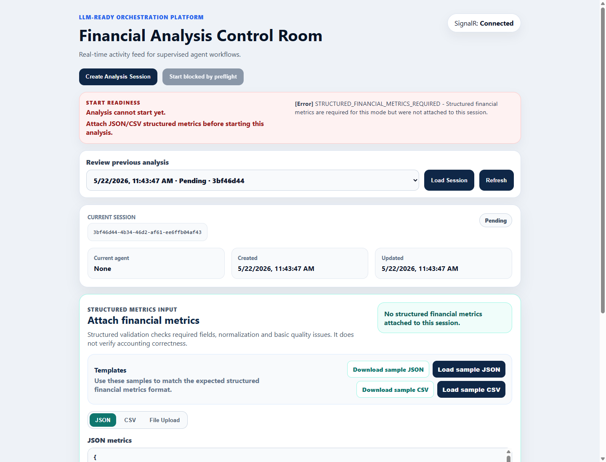

After JSON or CSV metrics are attached to the session, readiness refreshes and `Start Session` becomes available.

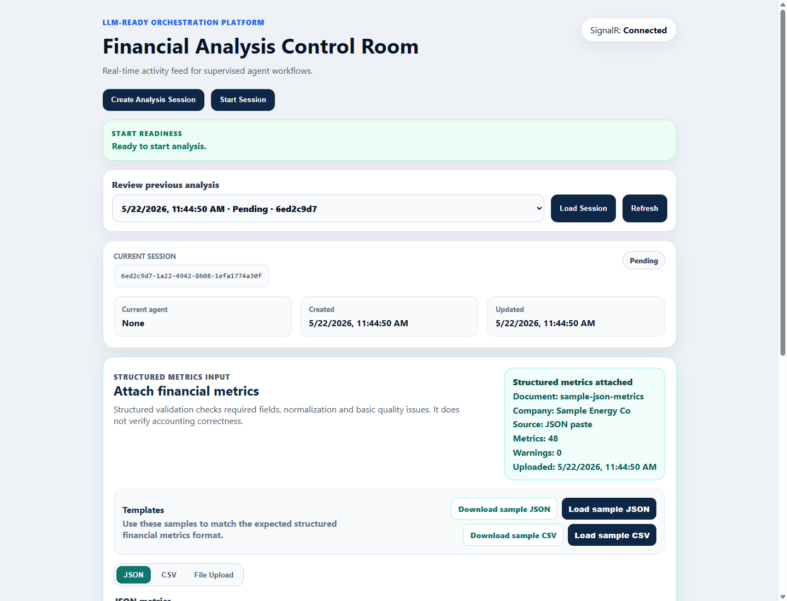

When the session starts, the DataAgent loads persisted session metrics first and records `financialAnalysis.metricsInputSource=session_context`.

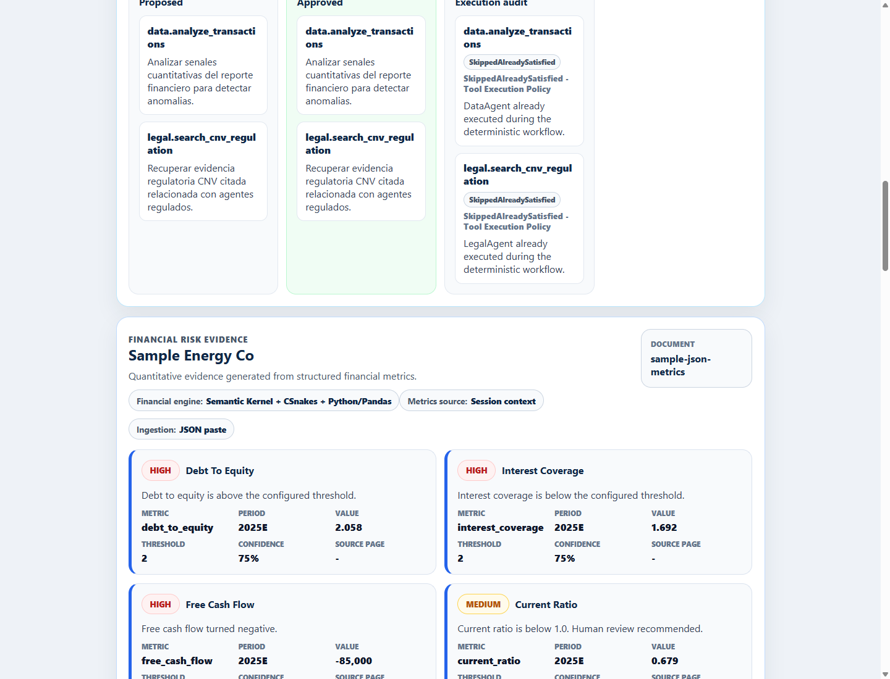

### Structured Input Configuration

`DataAgent__FinancialAnalysisToolsEnabled=false` remains the safe default.

Versioned configuration examples are available in:

```text
backend/Orchestration.Api/appsettings.Development.example.json
backend/Orchestration.Api/appsettings.ProductionLike.example.json
```

For local development, copy the development example to the ignored local settings file:

```powershell
Copy-Item backend/Orchestration.Api/appsettings.Development.example.json backend/Orchestration.Api/appsettings.Development.json
```

### Financial Analysis Mode Matrix

| Mode | FinancialAnalysisToolsEnabled | UseFixtureMetricsFallback | RequireSessionFinancialMetrics | Behavior |
| --- | --- | --- | --- | --- |
| Default | `false` | `false` | `false` | Uses the legacy anomaly-detection path. |
| Demo | `true` | `true` | `false` | Uses session metrics first and fixture fallback if missing. |
| Production-like | `true` | `false` | `true` | Requires session metrics and returns a safe review-required result if missing. |

Development configuration for structured financial analysis:

```text
DataAgent__FinancialAnalysisToolsEnabled=true
DataAgent__UsePythonFinancialAnalysis=true
DataAgent__UseLegacyAnomalyDetectionFallback=true
DataAgent__UseFixtureMetricsFallback=true
DataAgent__RequireSessionFinancialMetrics=false
```

Structured file upload defaults:

```text
StructuredFinancialMetricsFileUpload__MaxFileSizeBytes=1048576
StructuredFinancialMetricsFileUpload__AllowedExtensions__0=.json
StructuredFinancialMetricsFileUpload__AllowedExtensions__1=.csv
```

### Structured Input Limitations

This phase does not include:

- Excel ingestion,
- PDF parsing,
- OCR,
- table extraction from visual reports,
- LLM-based financial metric extraction,
- accounting correctness guarantees.

The system validates structure and computes advisory risk signals. It does not verify that the source document was transcribed correctly.

Structured metrics may be incomplete or manually provided. Missing data produces warnings or limitations instead of invented values.

## Screenshots

### Planner Review

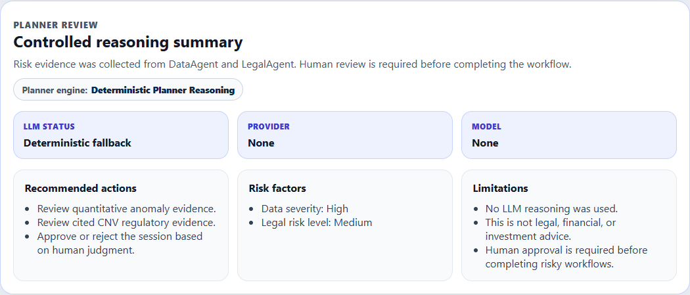

### Completed Dashboard

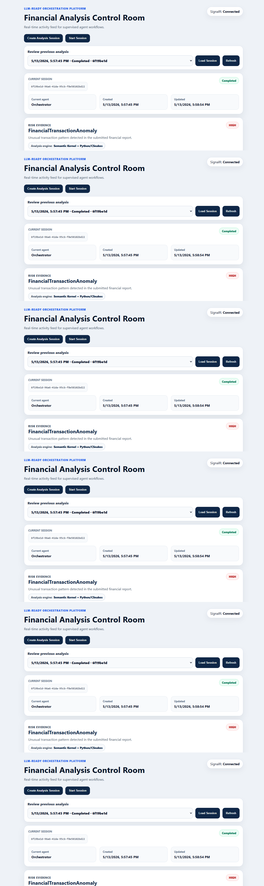

### Risk Evidence

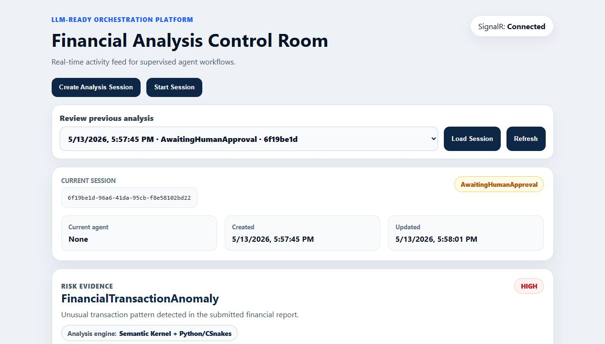

### Financial Risk Evidence

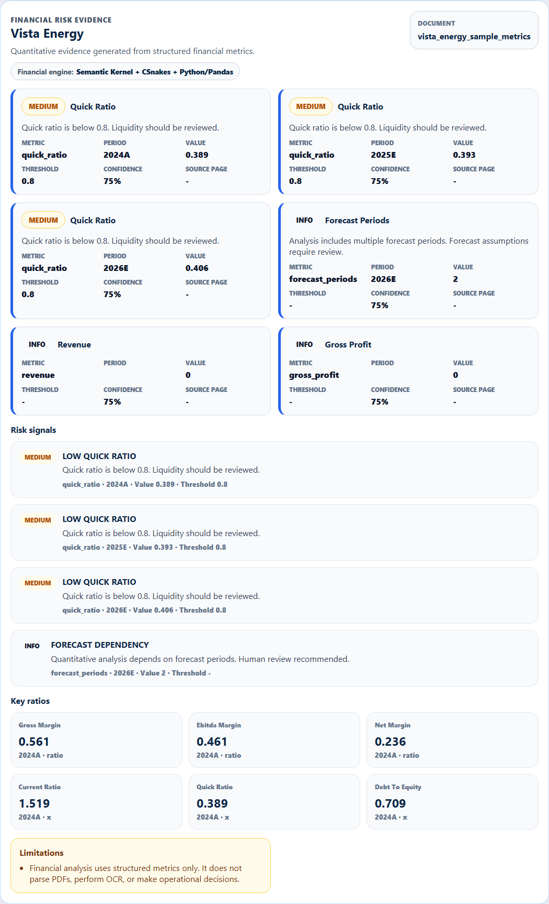

### Structured Metrics Input

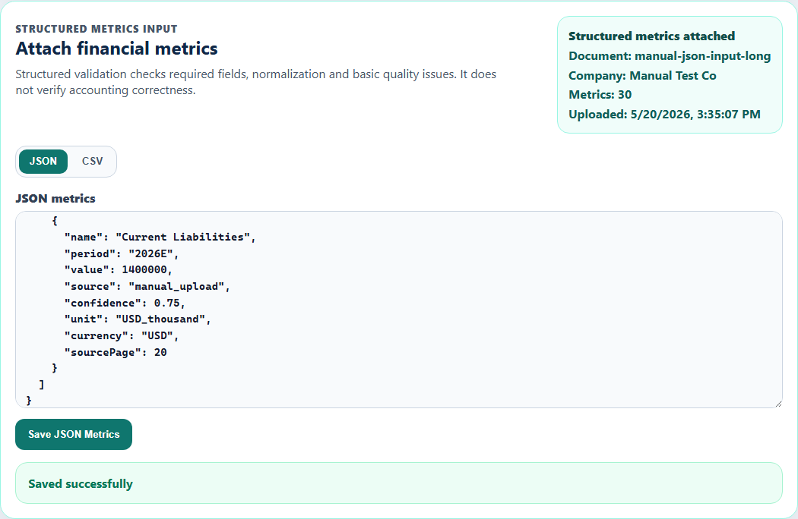

### Structured Metrics File Upload

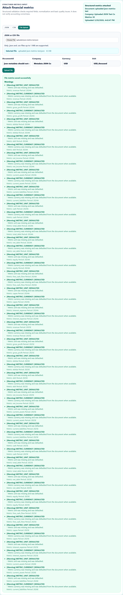

### Financial Risk Evidence from Structured Input


### Financial Risk Evidence from Uploaded Metrics

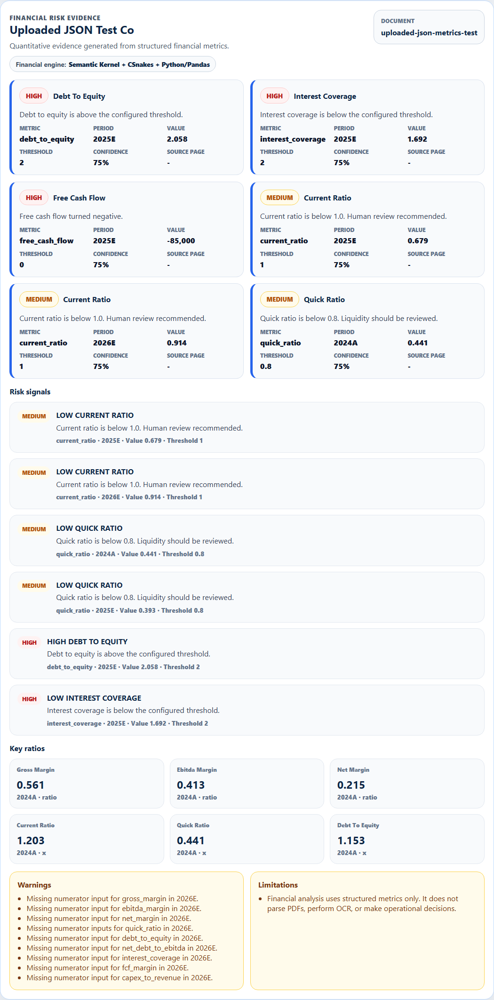

### Compliance Evidence

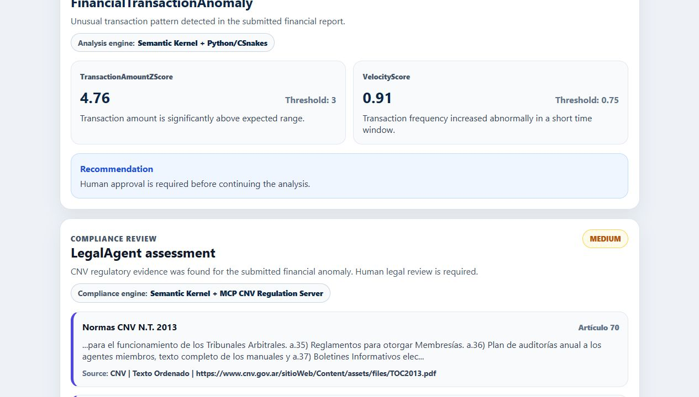

### Human Approval Gate

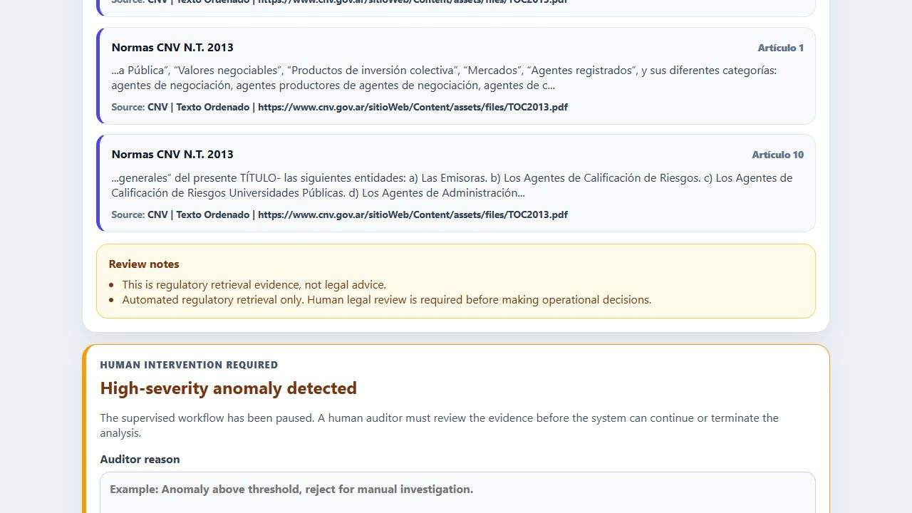

### Activity Feed

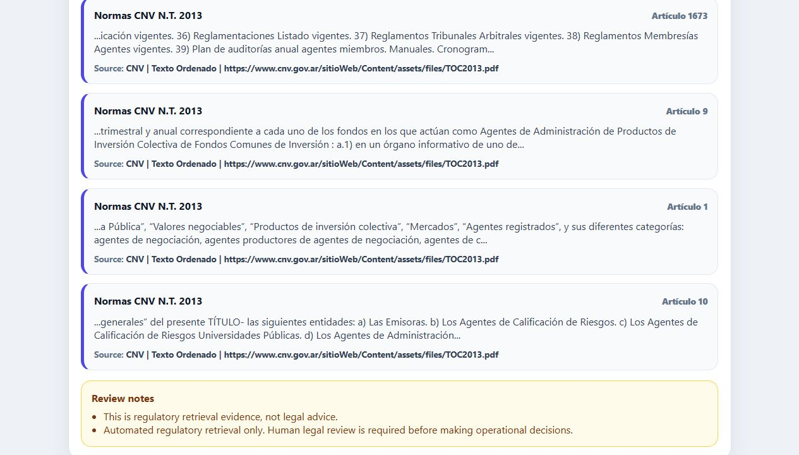

### Saved Sessions

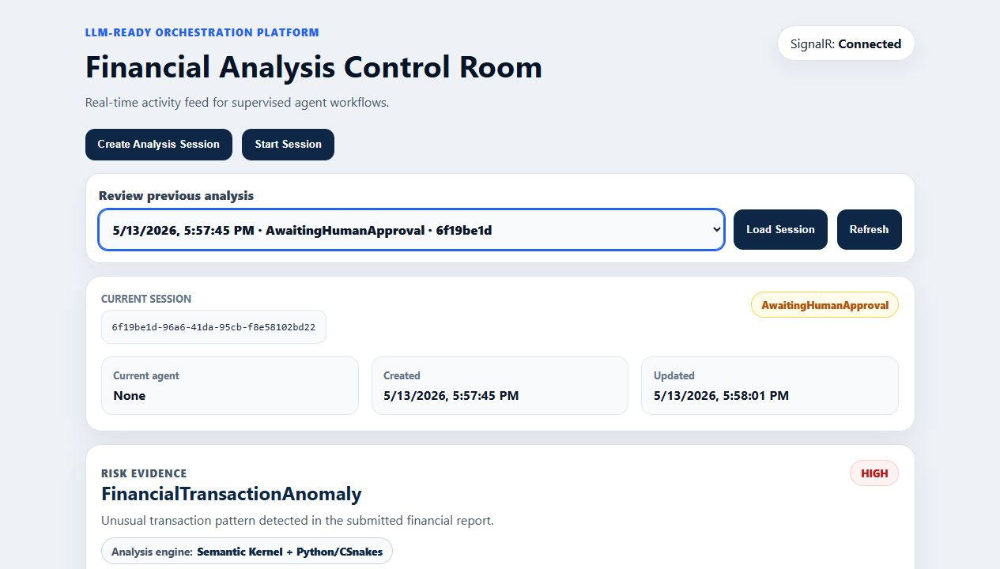

## Running Locally

### Backend

```bash
cd backend
dotnet run --project Orchestration.AppHost
```

Use `http://localhost:5173` for the frontend dev server. The default local CORS configuration targets `localhost`.

Aspire starts:

- PostgreSQL with pgvector,
- orchestration database,
- CNV regulation database,
- API,
- CNV migration executable,
- optional CNV ingestion executable,
- React frontend.

### Enabling LLM Planner Reasoning

The system works without an LLM by default.

To enable controlled LLM planner reasoning, set:

```text
Llm__Enabled=true
Llm__Provider=OpenAI
Llm__Model=<model-name>
Llm__ApiKey=<api-key>
Llm__ServiceId=planner-reasoning
```

Do not commit API keys.

When `Llm__Enabled=false`, no API key or model is required.

When `Llm__Enabled=true`, missing model or API key fails early with a clear configuration error.

### Enabling Controlled Tool Calling

Tool calling is disabled by default.

To enable audit-only shadow mode:

```text
ToolCalling__Enabled=true
ToolCalling__ExecutionMode=Shadow
```

In `Shadow` mode, the LLM can propose tool calls and the system validates/audits them, but the workflow evidence still comes from the deterministic `DataAgent` and `LegalAgent` path.

To enable plan-driven controlled execution:

```text
ToolCalling__Enabled=true
ToolCalling__ExecutionMode=PlanDriven
```

In `PlanDriven` mode, approved allowlisted calls execute through `ControlledToolExecutor`.

Use with LLM planner/tool proposal:

```text
Llm__Enabled=true
Llm__Provider=OpenAI
Llm__Model=<model-name>
Llm__ApiKey=<api-key>
ToolCalling__Enabled=true
ToolCalling__ExecutionMode=PlanDriven
```

`Shadow` remains the safe default.

### DataAgent Configuration

Defaults are safe. When financial analysis is disabled, the DataAgent uses the legacy anomaly-detection path.

```text
DataAgent__FinancialAnalysisToolsEnabled=false
DataAgent__UsePythonFinancialAnalysis=true
DataAgent__UseLegacyAnomalyDetectionFallback=true
DataAgent__UseFixtureMetricsFallback=false
DataAgent__RequireSessionFinancialMetrics=false
DataAgent__AiReviewEnabled=false
DataAgent__RiskThresholdProfile=default_oil_and_gas_equity_research
DataAgent__StructuredMetricsFixturePath=<optional>
```

To enable structured financial analysis:

```text
DataAgent__FinancialAnalysisToolsEnabled=true
```

The current provider expects structured financial metrics. `DataAgent__StructuredMetricsFixturePath` can point to a local structured metrics fixture for development validation.

### Tool Calling Diagnostics

In `Development`, use:

```text
POST /api/diagnostics/tool-calling/execute
```

Example:

```json
{
  "dynamicExecutionEnabled": true,
  "proposedCalls": [
    {
      "toolName": "data.analyze_transactions",
      "arguments": {
        "sessionId": "00000000-0000-0000-0000-000000000000",
        "reportName": "manual-diagnostic-report",
        "totalAmount": "125000",
        "transactionCount": "42",
        "submittedAt": "2026-05-06T14:00:00Z"
      },
      "reason": "Validate controlled DataAgent execution."
    },
    {
      "toolName": "legal.search_cnv_regulation",
      "arguments": {
        "query": "agentes",
        "area": "Agentes",
        "limit": "5",
        "requiresReview": "true"
      },
      "reason": "Validate CNV retrieval through MCP."
    }
  ]
}
```

The diagnostic endpoint is for development validation. It does not create sessions, transition workflow state, approve, or reject anything.

Financial analysis tools can also be validated through this endpoint when `ToolCalling__FinancialAnalysisToolsEnabled=true`. They still require validated `requestJson` payloads and remain read-only.

### CNV Regulation Ingestion

The CNV ingestion task is manual in Aspire.

Run it when:

- the CNV database is empty,
- the regulatory sources changed,
- parser/chunker logic changed,
- the PostgreSQL volume was deleted.

The ingestion task is intentionally not required for API startup.

### Frontend

```bash
cd frontend
npm install
npm run dev
```

The frontend receives the API URL through:

```text
VITE_API_URL
```

## Tests

Run backend tests:

```bash
cd backend
dotnet test
```

Latest validated backend suite: 210 tests.
Latest validated Python financial-analysis suite: 11 tests.

Current test coverage includes:

- state machine transitions,
- PlannerAgent delegation,
- deterministic planner reasoning,
- Semantic Kernel planner reasoning fallback,
- defensive LLM JSON parsing,
- LLM disabled configuration path,
- controlled planner reasoning metadata,
- LLM configuration validation,
- controlled tool-calling contracts,
- tool plan normalization,
- tool allowlist validation,
- controlled tool executor,
- execution policy decisions,
- plan-driven execution mode,
- tool execution result mapping,
- development diagnostics endpoint,
- planner `ContextJson` metadata,
- Python financial analysis calculations,
- .NET to CSnakes to Python financial-analysis mapping,
- Semantic Kernel financial-analysis plugin,
- ControlledToolExecutor financial-tool execution,
- DataAgent financial workflow fallback behavior,
- `financialAnalysis` context mapping,
- structured financial metrics validation,
- structured JSON metrics persistence,
- structured CSV metrics ingestion,
- structured JSON/CSV metrics file upload,
- session metrics provider ordering,
- structured metrics input UI compatibility,
- frontend build compatibility,
- CSnakes DataAgent integration,
- Semantic Kernel DataAgent wrapper,
- Semantic Kernel LegalAgent wrapper,
- MCP regulatory mapping,
- cited-result filtering,
- warning propagation.

Run frontend build:

```bash
cd frontend
npm run build
```

## Safety Notes

This project is not legal, financial, or investment advice.

The LegalAgent retrieves regulatory evidence from CNV-related sources. It does not determine legal compliance.

The DataAgent detects statistical anomalies. It does not block transactions, move money, freeze accounts, or make operational decisions.

Financial risk signals are advisory. The DataAgent does not determine fraud, legal violations, credit decisions, or operational actions.

Medium/high risk signals trigger human review through the existing HITL workflow.

The LLM does not make financial, legal, or operational decisions.

The LLM may generate reasoning summaries and propose read-only tool calls, but workflow transitions remain controlled by deterministic application logic.

The LLM cannot call approval, rejection, workflow-transition, legal-conclusion, financial-operation, system-command, or raw-database tools.

Plan-driven tool execution is limited to approved allowlisted tools and remains auditable.

Human approval is required before completing risky workflows.

This is intentional: the project demonstrates how higher-automation systems can be constrained by workflow state, evidence review, and human approval.

## Roadmap

### Next: Structured Financial Input Hardening and Extraction

The structured financial-analysis workflow can now consume pasted JSON, pasted CSV, uploaded JSON files, or uploaded CSV files persisted in the session context.

Planned upgrades:

- add client-side preview before persistence,
- add stronger financial consistency validation,
- later evaluate PDF table extraction or OCR,
- later evaluate LLM-assisted metric extraction with human review.

The LLM must not bypass the state machine or human approval flow.
