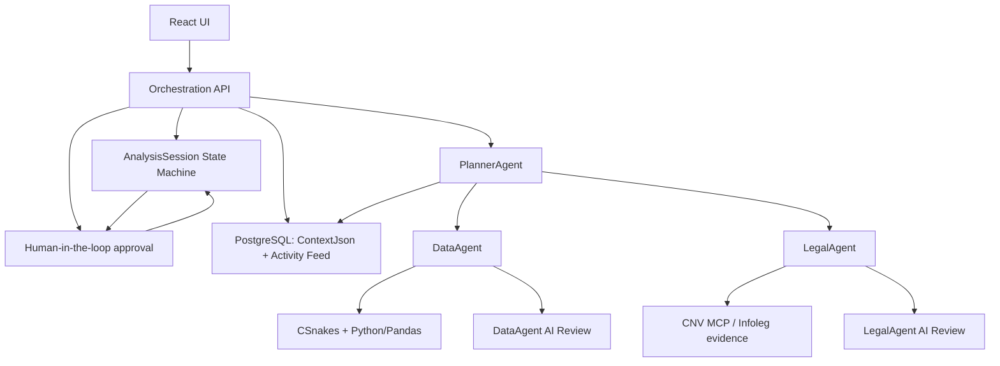

# Financial Analysis Control Room

AI-ready orchestration platform for supervised financial analysis workflows, combining deterministic agents, controlled LLM advisory layers, structured Python/Pandas analytics, regulatory evidence retrieval, controlled tool calling, real-time telemetry, and human-in-the-loop approval.

This repository is best described as a **controlled LLM-assisted human-in-the-loop orchestration platform**. LLM reasoning is advisory, workflow control remains deterministic, and human approval remains mandatory.

## Project Overview

The platform models a financial analysis workflow where specialized agents collect quantitative and regulatory evidence, persist every decision-relevant artifact, and pause before completion for human review. It is built around `AnalysisSession` records, deterministic state transitions, `ContextJson` audit snapshots, and an Activity Feed that can be restored when previous sessions are loaded.

The `DataAgent` computes quantitative financial evidence from structured metrics using CSnakes and Python/Pandas. Optional DataAgent AI review can interpret the already-computed evidence, but it cannot recompute ratios, create metrics, provide investment advice, or confirm accounting correctness.

The `LegalAgent` derives CNV/Infoleg search queries from financial risk signals and maps only cited regulatory retrieval results into review evidence. Optional LegalAgent AI review identifies possible regulatory review areas, but it does not provide legal advice, declare violations, or invent citations.

The `PlannerAgent` coordinates reasoning and controlled tool plans, but the State Machine remains the workflow authority. LLMs can summarize evidence or propose read-only tools under guardrails; they cannot approve, reject, complete, fail, or otherwise transition a session.

## Demo Script

A step-by-step production-like demo is available in [docs/demo-script.md](docs/demo-script.md).

## Current AI Status

This project now supports **optional controlled LLM-assisted planner reasoning** and **controlled tool calling**.

The LLM is used to generate structured reasoning summaries and, when enabled, propose tool calls for the `PlannerAgent`. It does not control workflow transitions, approve or reject sessions, execute tools autonomously, or make legal/financial decisions.

Current implementation:

- `PlannerAgent` coordinates the workflow in .NET.
- `PlannerAgent` can optionally use Semantic Kernel + OpenAI for advisory reasoning summaries.
- `PlannerAgent` can optionally ask the LLM to propose read-only tool calls.
- Proposed tool calls are normalized, validated against an allowlist, and audited.
- In `Shadow` mode, tool calls are not dynamically executed by the workflow.
- In `PlanDriven` mode, approved read-only tool calls can execute through a controlled executor.
- If LLM reasoning is disabled or fails, the system falls back to deterministic planner reasoning.
- `DataAgent` runs Python-based anomaly detection through Semantic Kernel + CSnakes.
- `DataAgent` can optionally run structured financial analysis with Python/Pandas through CSnakes.
- `LegalAgent` retrieves cited CNV regulatory evidence through Semantic Kernel + MCP.
- The workflow pauses for human approval when risk is detected.
- All activity is streamed in real time and persisted for audit review.

The architecture is intentionally designed so LLM-backed reasoning and tool proposals can assist the workflow without bypassing the state machine, HITL controls, MCP evidence retrieval, Python analytics, or audit trail.

## Controlled LLM Planner Reasoning

The `PlannerAgent` can optionally use an LLM through Semantic Kernel to generate structured reasoning summaries.

The LLM output is advisory only.

The LLM cannot:

- approve an analysis session,
- reject an analysis session,
- complete a workflow,
- fail a workflow,
- bypass human approval,
- directly or autonomously execute tools,
- override the state machine.

If LLM reasoning is disabled or fails, the system uses deterministic planner reasoning. The state machine and HITL approval gates remain mandatory.

Planner reasoning metadata is persisted in `ContextJson`, including:

- engine,
- summary,
- recommended actions,
- risk factors,
- limitations,
- whether LLM reasoning was used,
- whether deterministic fallback was used,
- provider,
- model,
- safe fallback reason when applicable.

No API keys, stack traces, or secrets are persisted.

## Controlled Tool Calling

The LLM can now propose tool calls, but every proposed call is normalized, validated against an allowlist, optionally executed through a controlled executor, audited, and still constrained by deterministic workflow state and mandatory human approval.

Controlled tool calling has two execution modes:

- `Shadow`: proposed calls are normalized, validated, and audited, but the existing deterministic `DataAgent` and `LegalAgent` path remains the source of workflow evidence.
- `PlanDriven`: proposed and approved calls are executed through `ControlledToolExecutor`; execution outputs are mapped back into `DataAgentResult` and `LegalAgentResult`.

`Shadow` is the default mode.

Current core allowlist:

- `data.analyze_transactions`: read-only statistical anomaly analysis owned by `DataAgent`.
- `legal.search_cnv_regulation`: read-only CNV regulatory retrieval owned by `LegalAgent` / MCP.

This typed production catalog is the source for proposal metadata, allowlist validation, controlled dispatch, result mapping, policy, and audit ownership. Structured ratio, comparison, signal, and evidence operations remain internal to the aggregate `DataAgent` workflow rather than separate Planner-callable tools.

Tool-calling pipeline:

```text
PlannerAgent
  -> IToolPlanProposalService
      -> DeterministicToolPlanProposalService
      OR
      -> SemanticKernelToolPlanProposalService
          -> Semantic Kernel
          -> OpenAI chat completion
          -> defensive JSON parsing
          -> deterministic fallback on failure
  -> ToolPlanNormalizer
  -> ToolPlanValidator
  -> ToolExecutionPolicy
  -> ControlledToolExecutor optional, PlanDriven only
  -> ToolExecutionResultMapper
  -> PlannerReasoningService
  -> deterministic HITL decision
```

Guardrails:

- unknown tools are rejected,
- workflow transition tools are rejected,
- approval/rejection tools are rejected,
- operational financial tools are rejected,
- legal conclusion tools are rejected,
- duplicate calls are normalized before validation,
- max tool-call count is capped,
- `OutputJson` is not persisted in `ContextJson`,
- failed or unmappable executions fall back to the deterministic agent path.

Rejected examples:

- `workflow.complete`
- `workflow.fail`
- `approval.approve_session`
- `approval.reject_session`
- `money.move`
- `account.freeze`
- `transaction.block`
- `legal.determine_violation`
- `legal.issue_advice`
- `system.execute_command`
- `database.raw_query`

### Shadow Mode

In `Shadow` mode, the workflow still runs:

```text
PlannerAgent
  -> DataAgent
  -> LegalAgent
  -> PlannerReasoning
  -> Tool plan proposal / validation / audit
  -> HITL decision
```

Approved tool calls are marked as execution-policy decisions such as `SkippedAlreadySatisfied` when the deterministic agent path already produced the evidence.

### PlanDriven Mode

In `PlanDriven` mode, the workflow runs:

```text
PlannerAgent
  -> Tool plan proposal
  -> Normalization
  -> Validation
  -> Controlled execution of approved read-only tools
  -> Map execution outputs to DataAgentResult / LegalAgentResult
  -> PlannerReasoning
  -> deterministic HITL decision
```

Only allowlisted tools can execute. The LLM never receives authority to transition workflow state or make approval decisions.

Legal mapping keeps the regulatory retrieval boundary intact:

- uncited MCP results do not become `LegalEvidence`,
- MCP warnings are propagated,
- review disclaimers are preserved,
- evidence is described as regulatory retrieval evidence,
- the system does not claim a legal violation.

### Development Diagnostics

Development-only endpoint:

```text
POST /api/diagnostics/tool-calling/execute
```

It validates a proposed plan, applies execution policy, optionally executes approved calls when `dynamicExecutionEnabled=true`, and returns proposed, approved, rejected, and executed calls.

It does not create or mutate `AnalysisSession` records and does not touch the state machine.

## What This Project Is

This is a human-supervised orchestration platform for financial analysis workflows.

It demonstrates how to combine:

- deterministic workflow orchestration,
- specialized agents,
- Python analytics,
- regulatory evidence retrieval,
- human approval gates,
- real-time activity streaming,
- persisted audit history,
- multi-user authentication & session isolation.

## What This Project Is Not Yet

This project does **not** currently include:

- autonomous LLM tool-calling,
- unrestricted tool execution,
- LLM-controlled workflow transitions,
- autonomous legal interpretation,
- universal visual table parsing,
- unsupervised or automatically trusted LLM financial metric extraction,
- natural language report understanding,
- automatic financial decision-making,
- production-grade regulatory advice.

The PlannerAgent may use an LLM for advisory reasoning summaries and controlled tool proposals only.

The LegalAgent retrieves regulatory evidence. It does not provide legal conclusions.
The DataAgent detects statistical anomalies and optional financial risk signals from structured metrics. It does not make operational decisions.
The human auditor remains responsible for approval or rejection.

## Architecture Overview



```text
React Dashboard
  | HTTP + SignalR
  v
ASP.NET Core API
  |
  |-- AnalysisSession State Machine
  |-- Human Approval Endpoints
  |-- SignalR ActivityHub
  |-- ActivityEvents Persistence
  |
  |-- PlannerAgent
        |
        |-- Planner Reasoning
        |     |-- Deterministic fallback
        |     |-- Semantic Kernel + OpenAI optional
        |
        |-- Controlled Tool Calling
        |     |-- Tool plan proposal
        |     |-- ToolPlanNormalizer
        |     |-- ToolPlanValidator allowlist
        |     |-- ToolExecutionPolicy
        |     |-- ControlledToolExecutor PlanDriven optional
        |     |-- ToolExecutionResultMapper
        |
        |-- DataAgent
        |     |-- ConfigurableDataAgent
        |     |     |-- legacy SemanticKernelDataAgent
        |     |     |     |-- PythonAnomalyDetectionPlugin
        |     |     |     |-- CSnakesDataAgent
        |     |     |     |-- Python anomaly_detection.py
        |     |     |
        |     |     |-- DataAgentFinancialAnalysisWorkflow optional
        |     |           |-- StructuredFinancialMetricsProvider
        |     |           |-- IPythonFinancialAnalysisService
        |     |           |-- CSnakesFinancialAnalysisService
        |     |           |-- Python financial_analysis.py
        |     |           |-- Pandas / NumPy
        |     |           |-- FinancialAnalysisContext
        |     |           |-- DataAgentResult
        |
        |-- LegalAgent
              |-- Semantic Kernel
              |-- LegalCompliancePlugin
              |-- MCP stdio client
              |-- CNV Regulation MCP Server
              |-- cnv_regulation PostgreSQL DB

PostgreSQL
  |-- orchestrationdb
  |-- cnv_regulation
```

## Agents

### PlannerAgent

Current implementation: deterministic .NET workflow coordinator with optional controlled LLM-assisted reasoning.

Responsibilities:

- starts the analysis workflow,
- delegates anomaly detection to the DataAgent,
- delegates regulatory evidence retrieval to the LegalAgent,
- combines agent results,
- generates a planner reasoning summary,
- proposes, normalizes, validates, and audits controlled tool calls when enabled,
- executes approved read-only tools only in `PlanDriven` mode,
- returns whether human approval is required through deterministic rules.

The Orchestrator applies State Machine transitions. Planner reasoning does not control workflow state.

Current reasoning behavior:

```text
PlannerAgent
  -> IPlannerReasoningService
      -> DeterministicPlannerReasoningService
      OR
      -> SemanticKernelPlannerReasoningService
          -> Semantic Kernel
          -> OpenAI chat completion
          -> defensive JSON parsing
          -> deterministic fallback on failure
```

The `PlannerAgent` does not allow the LLM to approve, reject, complete, fail, or transition a workflow state.

Current tool-calling behavior:

```text
PlannerAgent
  -> IToolPlanProposalService
  -> ToolPlanNormalizer
  -> ToolPlanValidator
  -> ToolExecutionPolicy
  -> ControlledToolExecutor only when ExecutionMode=PlanDriven
```

The final HITL decision remains deterministic:

```text
requiresHumanApproval =
  dataResult.HasAnomaly ||
  legalResult.HasComplianceRisk
```

### DataAgent

Current implementation: configurable Python analytics path.

By default, the DataAgent uses the legacy Semantic Kernel anomaly-detection path.

When `DataAgent__FinancialAnalysisToolsEnabled=true`, it can run the structured financial-analysis workflow.

Pipeline:

```text
DataAgent
  -> ConfigurableDataAgent
      -> legacy SemanticKernelDataAgent
      OR
      -> DataAgentFinancialAnalysisWorkflow
          -> StructuredFinancialMetricsProvider
          -> IPythonFinancialAnalysisService
          -> CSnakesFinancialAnalysisService
          -> financial_analysis.py
          -> Pandas / NumPy
          -> IDataAgentAiReviewService optional advisory review
          -> FinancialAnalysisContext
          -> DataAgentResult
```

The DataAgent returns backward-compatible anomaly evidence, including metrics, thresholds, severity, and explanation. When structured financial analysis is enabled, it also exposes richer `financialAnalysis` context with ratios, period comparisons, risk signals, risk evidence, warnings, limitations, and optional advisory `aiReview`.

### LegalAgent

Current implementation: Semantic Kernel plugin layer over MCP regulatory retrieval.

Pipeline:

```text
LegalAgent
  -> Semantic Kernel
  -> LegalCompliancePlugin
  -> McpRegulatoryKnowledgeSource
  -> CnvRegulationStdioMcpClient
  -> CnvRegulation.McpServer
  -> cnv_regulation PostgreSQL database
```

LegalAgent AI review can be backed by Semantic Kernel when enabled, but it is constrained to advisory review over provided FinancialAnalysis and CNV/Infoleg evidence. The deterministic fallback remains the safe default.

#### LegalAgent CNV query strategy from FinancialAnalysis
- **Derivation strategy**: The LegalAgent dynamically derives targeted CNV/Infoleg searches from the `DataAgent`'s financial risk signals and warning indicators via `ILegalCnvQueryStrategy`, rather than executing static queries.
- **Evidence citations constraint**: Any retrieved CNV/Infoleg evidence must include valid regulatory citations to be recognized as strong support. Evidence without citations is ignored for regulatory findings mapping and generates warnings instead.
- **Strict safety boundaries**:
  - The LegalAgent **does not declare legal violations**.
  - The LegalAgent **does not provide legal advice**.
  - The LegalAgent **does not invent citations or regulations**.
  - The LegalAgent identifies possible regulatory review areas for human review.

#### LegalAgent quality cases

Curated LegalAgent quality tests cover liquidity and leverage financial risk signals with cited CNV/Infoleg evidence, missing citations, no relevant cited evidence, and deterministic/LLM fallback behavior.

The tests assert that:

- possible review areas only use provided citations,
- uncited MCP evidence is ignored as strong support and produces warnings,
- missing or irrelevant evidence stays safe with warnings/limitations,
- LLM output with invented citations is pruned,
- forbidden legal language falls back to deterministic review,
- the LegalAgent does not declare legal violations or provide legal advice.

The CNV/Infoleg citations used in these tests are explicit test fixtures and are not represented as real legal conclusions.

#### Production-like E2E validated flow

Backend E2E coverage validates the production-like flow without external services:

```text
Create Analysis Session
  -> Attach JSON structured metrics
  -> Start Session preflight passes
  -> DataAgent uses session_context metrics
  -> quantitative financialAnalysis + aiReview are persisted
  -> LegalAgent derives CNV queries from financial risk signals
  -> cited CNV evidence + legalReview are persisted
  -> Planner review + toolPlan audit are persisted
  -> AwaitingHumanApproval
  -> Approve
  -> Completed
  -> Reload with ContextJson and Activity Feed preserved
```

The production-like mode keeps fixture fallback disabled and requires session-attached structured metrics:

```text
DataAgent__FinancialAnalysisToolsEnabled=true
DataAgent__UseFixtureMetricsFallback=false
DataAgent__RequireSessionFinancialMetrics=true
```

The HITL rejection path is also covered by E2E tests. Human rejection moves the session to the existing failure state, preserves analysis evidence and legal review context, keeps Activity Feed history for auditability, and does not emit the approval/completion path.


## Workflow States

The workflow is controlled by a strict state machine.

```text
Pending
  -> DataGathering
  -> AwaitingHumanApproval
  -> Completed

Pending
  -> DataGathering
  -> AwaitingHumanApproval
  -> Failed
```

Main states:

- `Pending`: analysis session was created.
- `DataGathering`: agents are collecting evidence.
- `AwaitingHumanApproval`: workflow is paused and requires human decision.
- `Completed`: human auditor approved the workflow.
- `Failed`: human auditor rejected the workflow or the workflow failed.

The system does not allow risky workflows to complete without explicit human approval.

## Human-in-the-Loop Safety Model

The system is intentionally designed to avoid fully autonomous operational decisions.

When the DataAgent or LegalAgent detects risk:

1. the workflow transitions to `AwaitingHumanApproval`,
2. evidence is persisted in PostgreSQL,
3. activity events are streamed to the React dashboard,
4. the approval panel is displayed,
5. a human auditor must approve or reject the session.

The system only moves to `Completed` after explicit approval.
If rejected, the session moves to `Failed`.

## Multi-User Authentication & Session Isolation

The platform includes a robust, production-grade security architecture that ensures data privacy and workspace isolation across multiple users.

### Security & Privacy Architecture
- **Authentication**: Built on **ASP.NET Core Identity** and secured via secure, stateless **JWT Bearer Tokens**.
- **Authorization**: All API endpoints and SignalR connection handshakes require a valid JWT token.
- **Session Isolation**: Every `AnalysisSession` is owned by a specific `UserId`. All database queries, telemetry, and operations are strictly isolated—users can only query, modify, or run analysis on their own sessions. Any attempt to access another user's session returns a `404 Not Found` (rather than a `403 Forbidden`) to prevent resource enumeration.

### React Authentication Experience
- **Premium Route Guard**: Unauthenticated users are seamlessly redirected to a premium, glassmorphic login/registration screen.
- **Obsidian Dark Mode UI**: Standardized obsidian background layouts with glowing inputs and custom form animations.
- **User Avatar Profile & Logout**: Shows a glowing profile badge in the header displaying the capitalized first letter of the user's email, alongside the full email address, and a dedicated logout button that safely terminates SignalR connections and clears cached credentials.

## Auditability

The platform persists:

- analysis sessions,
- current workflow state,
- planner reasoning summaries,
- LLM/fallback metadata,
- proposed, approved, rejected, and execution-audited tool calls,
- agent evidence,
- structured financial-analysis context,
- financial risk signals and quantitative evidence,
- legal/regulatory findings,
- warnings and disclaimers,
- real-time activity events,
- human decisions.

The Activity Feed is not only streamed via SignalR; it is also stored in PostgreSQL and can be restored when loading previous sessions.

Planner reasoning events include:

- `planner_reasoning_completed`
- `planner_reasoning_fallback_used`

These events make it clear whether reasoning came from deterministic fallback or an LLM-assisted path.

Tool-calling events include:

- `tool_plan_proposed`
- `tool_plan_validated`
- `tool_call_rejected`
- `tool_call_skipped`
- `tool_call_executed`
- `tool_execution_fallback_used`

These events make it clear whether tool calls were proposed, rejected, skipped by policy, executed by the controlled executor, or safely routed back to deterministic agents.

## MCP Regulatory Retrieval

The LegalAgent integrates with a local MCP server for CNV regulatory retrieval.

Current MCP server:

```text
tools/CnvRegulation.McpServer
```

Transport:

```text
stdio
```

Primary tool:

```text
search_cnv_regulation
```

The LegalAgent only treats MCP results as evidence when they include citations.

Uncited results are ignored.

Warnings and disclaimers are propagated to the frontend to make clear that the system performs regulatory retrieval, not legal advice.

## Python Analytics via CSnakes

The DataAgent executes Python code from the .NET workflow using CSnakes.

Current flow:

```text
SemanticKernelDataAgent
  -> PythonAnomalyDetectionPlugin
  -> CSnakesDataAgent
  -> anomaly_detection.py
```

The Python analyzer returns structured anomaly evidence:

- anomaly flag,
- severity,
- summary,
- metric evidence,
- thresholds,
- interpretation.

The current implementation is deterministic and testable. It does not require an LLM.

## DataAgent Financial Analysis Tools

The DataAgent can optionally run structured financial analysis using Python/Pandas through CSnakes.

This feature is disabled by default and can be enabled with:

```text
DataAgent__FinancialAnalysisToolsEnabled=true
```

Current capabilities:

- compute financial ratios,
- compare financial periods,
- detect financial risk signals,
- summarize quantitative evidence,
- expose financial risk evidence in the dashboard.

The current implementation expects structured financial metrics. JSON and CSV inputs are already structured. PDF ingestion starts with deterministic extraction from native PDF text or local OCR output and can optionally use MarkItDown plus a Semantic Kernel extraction agent as a review-gated enrichment fallback. It does not perform universal visual table extraction, and semantic candidates are not trusted silently.

Financial-analysis architecture:

```text
DataAgent
  -> ConfigurableDataAgent
      -> legacy SemanticKernelDataAgent
      OR
      -> DataAgentFinancialAnalysisWorkflow
          -> StructuredFinancialMetricsProvider
          -> IPythonFinancialAnalysisService
          -> CSnakesFinancialAnalysisService
          -> financial_analysis.py
          -> Pandas / NumPy
          -> IDataAgentAiReviewService optional advisory review
          -> FinancialAnalysisContext
          -> DataAgentResult
```

### DataAgent Quantitative + AI Review

Python/Pandas through CSnakes remains the authoritative quantitative engine. It computes ratios, period comparisons, risk signals, and quantitative evidence.

`financialAnalysis.aiReview` is an advisory interpretation layer. It can run through Semantic Kernel/LLM when enabled, or through the deterministic fallback. It is persisted in `AnalysisSession.ContextJson` for reload/audit, but it does not recompute metrics, create new metrics, modify risk signals, modify risk evidence, provide investment advice, claim accounting correctness, or replace human review.

Default:

```text
DataAgent__AiReviewEnabled=false
```

When `DataAgent__AiReviewEnabled=false`, the persisted AI review uses deterministic fallback metadata:

```json
{
  "usedLlm": false,
  "usedFallback": true,
  "provider": null,
  "model": null,
  "failureReason": null
}
```

When `DataAgent__AiReviewEnabled=true` and `Llm__Enabled=true`, Semantic Kernel attempts a JSON-only advisory review. Provider failures, empty output, invalid JSON, schema issues, or unsafe content fall back to the deterministic review with a safe `failureReason`.

### Financial Analysis Operations

Ratio calculation, period comparison, financial-risk detection, and quantitative-evidence summarization execute as deterministic internal `DataAgent` operations. The Planner receives their aggregate, traceable `DataAgentResult`; it does not call these operations independently.

#### Execution Status, Business Risk, and HITL

Technical execution status is independent from calculated business risk. The workflow preserves valid partial evidence and fails closed when a required stage cannot be trusted:

| Execution | Meaning | Business risk | HITL |
|---|---|---|---|
| `succeeded` | All required stages completed. | Calculated normally. | Based on business evidence. |
| `degraded` | Some required stages failed; valid evidence is retained. | A partial calculation may exist. | Required. |
| `failed` | Signal and risk assessment is unavailable. | `Unknown`. | Required. |
| `legacy_unknown` | Historical execution metadata is absent. | Do not infer success. | Required for new executions. |

The stable technical failure codes are `PYTHON_INVOCATION_FAILED` for a failed Python call, `PYTHON_RESPONSE_INVALID` for malformed or structurally invalid Python output, and `FINANCIAL_ANALYSIS_UNEXPECTED_FAILURE` for an otherwise unclassified failure caught at the workflow boundary.

Structured operation logs contain `SessionId`, operation, duration, execution status, and failure code. They do not log serialized requests, Python responses, metric values, or document content. The technical execution banner and financial-analysis Activity Feed events expose only curated status, affected operation labels, and stable failure codes; they never use raw payloads, metric values as failure detail, or exception text. This safety boundary does not hide valid financial evidence: successfully calculated metrics and retained partial evidence remain visible in `Financial Risk Evidence`.

Warnings returned by a successful operation describe domain or data-quality conditions. Warnings alone are not a technical failure and do not change a successful execution status. A successful analysis with no risk signals remains a legitimate Low-risk result; a technical failure is never represented as Low risk.

### Current Limitations

This phase does not include:

- universal visual PDF table parsing,
- unsupervised or automatically trusted LLM metric extraction,
- production-grade accounting validation,
- legal or investment advice.

The financial analysis pipeline currently uses structured financial metrics, including a sample fixture inspired by an equity research report.

## Structured Financial Metrics Input

The platform supports structured financial metrics input through pasted JSON, pasted CSV, uploaded `.json` / `.csv` files, or uploaded `.pdf` financial analysis reports.

The input is validated, normalized, persisted in the analysis session context, and later consumed by the DataAgent financial workflow.

Current flow:

```text
Create Analysis Session
  -> Attach pasted JSON, pasted CSV, uploaded JSON/CSV metrics, or uploaded PDF metrics
  -> Validate and persist metrics in ContextJson
  -> Start Session
  -> DataAgent loads persisted metrics first
  -> Python/Pandas financial analysis through CSnakes
  -> Financial Risk Evidence panel
  -> Human approval gate
```

Saving metrics does not start the analysis automatically and does not change the workflow state. The user must explicitly start the session.

Supported dashboard input modes:

- Paste JSON,
- Paste CSV,
- Upload JSON/CSV/PDF file.

Sample templates are available from the dashboard:

- `frontend/public/templates/structured-financial-metrics-sample.json`,
- `frontend/public/templates/structured-financial-metrics-sample.csv`.

The templates use synthetic sample values. They are examples of the expected structure, not accounting guidance or source-document verification.

The validated report summary and structured metrics are persisted in
`AnalysisSession.ContextJson` under separate roots:

```text
financialReport
structuredFinancialMetrics
```

`financialReport` contains the caller-supplied `reportName`, `totalAmount`,
`transactionCount`, and `submittedAt`. These values remain session-scoped and
survive the complete workflow. The Planner and tool-plan proposal consume these
persisted values exactly; they do not derive, default, or replace them.

The persisted block includes audit provenance:

- ingestion method (`json_paste`, `csv_paste`, `json_file`, `csv_file`, or `pdf_file`),
- metric count,
- validation warning count,
- upload timestamp,
- sanitized file name and file size for uploads,
- SHA-256 content hash for uploads.

Raw uploaded files are not stored. Activity Feed records successful metric attachment without logging raw JSON, raw CSV, or metric values. The content hash is for traceability only; it does not prove accounting correctness.

The resulting analysis context is persisted under:

```text
financialAnalysis
```

### PDF Metrics Extraction and Human Review

PDF uploads use a deterministic-first flow:

```text
PDF upload
  -> native text extraction
  -> deterministic supported-metric parser
  -> if incomplete, optional local searchable-PDF OCR
  -> MarkItDown 0.1.6 Markdown conversion
  -> optional Semantic Kernel extraction agent using the shared Llm:* config
  -> deterministic reconciliation and validation
  -> accepted, review_required, or failed
```

The deterministic parser remains the first path and the structured metrics validator remains authoritative. When the deterministic result is complete enough, the PDF is accepted without MarkItDown or LLM involvement. When coverage, metadata, confidence, conflicts, or missing fields require enrichment, the service can convert the PDF to Markdown with `markitdown[pdf]==0.1.6` and ask the semantic extraction agent to map candidates into the existing structured metrics contract.

Image-only and hybrid PDFs are handled locally. If native text is insufficient, the backend creates a searchable PDF using local OCR tools (`pdftoppm`, `tesseract`, and `pypdf`) and then passes that searchable PDF to MarkItDown. This project does not use `markitdown-ocr`, cloud OCR, remote PDF services, or an LLM client inside MarkItDown.

Semantic extraction has three modes:

| Mode | Behavior |
| --- | --- |
| `Shadow` | Runs semantic enrichment for diagnostics, but persists the deterministic result only. |
| `ReviewOnly` | Creates review drafts for semantic, inferred, conflicting, or incomplete data. This is the default. |
| `AutoAccept` | Persists semantic output only when all automatic-acceptance rules pass: explicit candidates, required metadata present, no unresolved conflicts, high confidence, and deterministic validation success. |

The semantic agent reuses the same configuration family as the PlannerAgent:

```text
Llm__Enabled=true
Llm__Provider=OpenAI
Llm__Model=<model-name>
Llm__ApiKey=<api-key>
Llm__ServiceId=planner-reasoning
FinancialMetricsExtraction__SemanticEnrichmentEnabled=true
FinancialMetricsExtraction__Mode=ReviewOnly
```

Do not commit API keys. If `FinancialMetricsExtraction__SemanticEnrichmentEnabled=false`, or if `Llm__Enabled=false`, the semantic extraction agent is unavailable and the system falls back to deterministic PDF handling.

When the response outcome is `review_required`, active `structuredFinancialMetrics` are not changed. A `FinancialMetricsExtractionDraft` is stored separately, the dashboard opens the review editor, and `Start Session` is blocked until the draft is confirmed or discarded. The reviewer can accept, reject, correct, or add candidates. Confirming a valid draft persists active metrics with `ingestionMethod=pdf_file_reviewed`; discarding leaves prior active metrics unchanged.

Review endpoints:

```http
GET  /api/analysis-sessions/{sessionId}/financial-metrics/review
PUT  /api/analysis-sessions/{sessionId}/financial-metrics/review/{draftId}
POST /api/analysis-sessions/{sessionId}/financial-metrics/review/{draftId}/confirm
POST /api/analysis-sessions/{sessionId}/financial-metrics/review/{draftId}/discard
```

### JSON Metrics Input

Example:

```json
{
  "documentId": "manual-json-input",
  "company": "Manual Test Co",
  "currency": "USD",
  "unit": "USD_thousand",
  "metrics": [
    {
      "name": "Revenue",
      "period": "2024A",
      "value": 1647768,
      "source": "manual_upload",
      "confidence": 0.9
    },
    {
      "name": "Gross Profit",
      "period": "2024A",
      "value": 924000,
      "source": "manual_upload",
      "confidence": 0.85
    }
  ],
  "reportSummary": {
    "reportName": "manual-json-input.json",
    "totalAmount": 842350.75,
    "transactionCount": 187,
    "submittedAt": "2026-07-12T18:30:00Z"
  }
}
```

Metric names are normalized. For example, `Gross Profit` becomes `gross_profit`.

Missing metric-level `unit` or `currency` values can be defaulted from the document-level metadata and reported as validation warnings.

### CSV Metrics Input

Example:

```csv
name,period,value,unit,currency,source,sourcePage,confidence
Revenue,2024A,1647768,USD_thousand,USD,manual_upload,18,0.9
Gross Profit,2024A,924000,USD_thousand,USD,manual_upload,18,0.85
```

CSV input is parsed deterministically without PDF/OCR or LLM extraction.

For pasted CSV, send the CSV text and report summary in the request envelope:

```json
{
  "documentId": "manual-csv-input",
  "company": "Manual Test Co",
  "currency": "USD",
  "unit": "USD_thousand",
  "csv": "name,period,value,unit,currency,source,sourcePage,confidence\nRevenue,2024A,1647768,USD_thousand,USD,manual_upload,18,0.9",
  "reportSummary": {
    "reportName": "manual-csv-input.csv",
    "totalAmount": 842350.75,
    "transactionCount": 187,
    "submittedAt": "2026-07-12T18:30:00Z"
  }
}
```

Invalid headers, invalid numbers, invalid source pages, malformed quotes, and missing required values are reported as safe validation errors.

### PDF Metrics Input

PDF upload extracts supported financial metric rows into the same structured metrics contract used by JSON and CSV. Native text extraction runs first. If native text is too sparse, or native text is present but no supported metrics are found, the extractor falls back to local OCR.

Local OCR uses configured `pdftoppm` and `tesseract` executables. No external OCR service, hosted document AI, or LLM is required.

Supported PDF metric aliases currently include revenue/sales, gross profit, operating income, EBITDA, EBIT, net income, cash, short-term investments, receivables, inventory, current assets, current liabilities, total debt, net debt, equity, capex, free cash flow, interest expense, and shares.

OCR metrics below `StructuredFinancialMetricsPdfExtraction__MinimumMetricConfidence` are ignored. If no extracted metric meets the threshold, the PDF upload returns a validation error instead of persisting low-confidence data.

PDF review drafts use schema v2. A legacy schema-v1 draft has no trustworthy
report summary: open the review editor, complete all four report fields, and
confirm. Confirmation validates the summary and upgrades the draft to v2 in the
same persistence operation; it never invents summary values.

### Financial Report Summary Validation

Every JSON, CSV, and PDF ingestion path requires a valid report summary. Stable
field-validation codes are:

- `REPORT_SUMMARY_REQUIRED`
- `REPORT_NAME_REQUIRED`
- `TOTAL_AMOUNT_REQUIRED` / `TOTAL_AMOUNT_INVALID`
- `TRANSACTION_COUNT_REQUIRED` / `TRANSACTION_COUNT_INVALID`
- `SUBMITTED_AT_REQUIRED` / `SUBMITTED_AT_INVALID`

Workflow context resolution reports `FINANCIAL_REPORT_SUMMARY_REQUIRED` when
the persisted block is absent and `FINANCIAL_REPORT_SUMMARY_INVALID` when it is
malformed. Fix the source input or review draft; the Planner never supplies
fallback report values.

### Structured Metrics Endpoints

```http
POST /api/financial-metrics/validate
POST /api/analysis-sessions/{sessionId}/financial-metrics
GET  /api/analysis-sessions/{sessionId}/financial-metrics
POST /api/analysis-sessions/{sessionId}/financial-metrics/csv
POST /api/analysis-sessions/{sessionId}/financial-metrics/file
```

The validation endpoint does not persist data. The session endpoints attach or retrieve structured metrics for a specific analysis session.

### Structured Metrics File Upload

The dashboard and API support uploading `.json`, `.csv`, and `.pdf` files.

```http
POST /api/analysis-sessions/{sessionId}/financial-metrics/file
```

Content type:

```text
multipart/form-data
```

Form fields:

- `file`: required `.json`, `.csv`, or `.pdf` file,
- `documentId`: optional for JSON/PDF, required for CSV,
- `company`: optional,
- `currency`: optional,
- `unit`: optional,
- `ReportName`: required for CSV/PDF; JSON reads `reportSummary.reportName` from the file,
- `TotalAmount`: required, non-negative decimal for CSV/PDF,
- `TransactionCount`: required, non-negative integer for CSV/PDF,
- `SubmittedAt`: required ISO-8601 timestamp for CSV/PDF.

For JSON uploads, embed the complete `reportSummary` object shown above. JSON
file content is authoritative for the report summary; multipart summary fields
are used by CSV and PDF uploads.

Uploaded JSON and CSV files are parsed in memory, validated, normalized, and persisted as structured metrics in the analysis session context. PDF files follow the deterministic-first extraction path and may return `review_required`; in that case, the review draft is stored separately and active metrics are not changed until a human confirms it.

The raw file is not stored.

Supported formats:

- `.json`
- `.csv`
- `.pdf`

The default upload size limit is 20 MB.

The file upload path uses the same validation, normalization, and session persistence flow as pasted JSON or CSV input. Analysis still starts only when the user clicks `Start Session`.

This is not Excel ingestion, unsupervised LLM extraction, source-document verification, or universal visual table parsing.

### Metrics Provider Order

When the financial DataAgent workflow is enabled, metrics are loaded in this order:

1. metrics persisted in the current `AnalysisSession.ContextJson`,
2. fixture fallback, only when `DataAgent__UseFixtureMetricsFallback=true`,
3. safe result or legacy fallback depending on configuration.

Fixture fallback is intended for development/demo only. Production-like runs should set `DataAgent__UseFixtureMetricsFallback=false` and attach session-specific structured metrics before starting analysis. When fallback is used, `financialAnalysis.metricsInputSource` is set to `fixture_fallback`, the dashboard shows a warning, and the Activity Feed records `financial_metrics_fixture_fallback_used`.

Production-like mode can require session-attached metrics explicitly:

```text
DataAgent__FinancialAnalysisToolsEnabled=true
DataAgent__UseFixtureMetricsFallback=false
DataAgent__RequireSessionFinancialMetrics=true
```

In this mode, missing metrics produce a safe review-required result with `financialAnalysis.metricsInputSource=none`. The system does not use the demo fixture fallback and does not treat missing structured metrics as a real financial analysis.

### Start Session Preflight Guardrail

In production-like mode, sessions cannot be started until structured financial metrics are attached:

```text
DataAgent__FinancialAnalysisToolsEnabled=true
DataAgent__UseFixtureMetricsFallback=false
DataAgent__RequireSessionFinancialMetrics=true
```

If metrics are missing, `POST /api/analysis-sessions/{sessionId}/start` returns `409 Conflict` with a structured preflight result:

```json
{
  "canStart": false,
  "errors": [
    {
      "code": "STRUCTURED_FINANCIAL_METRICS_REQUIRED",
      "message": "Structured financial metrics are required for this mode but were not attached to this session.",
      "severity": "Error"
    }
  ],
  "warnings": []
}
```

The failed preflight does not change workflow state and does not execute the PlannerAgent, DataAgent, or LegalAgent. Attach JSON, CSV, or PDF metrics, then start the session again.

The dashboard also calls:

```http
GET /api/analysis-sessions/{sessionId}/start-preflight
```

to show start readiness before the user clicks `Start Session`. If the preflight says `canStart=false`, the UI disables the button and shows the missing input issue. This is only a UX guardrail; `POST /start` still enforces the same preflight server-side.

### Production-like Start Readiness Flow

In production-like mode, the backend preflight is the authority:

```text
DataAgent__FinancialAnalysisToolsEnabled=true
DataAgent__UseFixtureMetricsFallback=false
DataAgent__RequireSessionFinancialMetrics=true
```

The dashboard calls `GET /api/analysis-sessions/{sessionId}/start-preflight` to show readiness before the user clicks `Start Session`. Missing required metrics block the start request with `STRUCTURED_FINANCIAL_METRICS_REQUIRED`; no workflow state changes and no agents execute.


After JSON, CSV, or PDF metrics are attached to the session, readiness refreshes and `Start Session` becomes available.


When the session starts, the DataAgent loads persisted session metrics first and records `financialAnalysis.metricsInputSource=session_context`.


### Structured Input Configuration

`DataAgent__FinancialAnalysisToolsEnabled=false` remains the safe default.

Versioned configuration examples are available in:

```text
backend/Orchestration.Api/appsettings.Development.example.json
backend/Orchestration.Api/appsettings.ProductionLike.example.json
```

For local development, copy the development example to the ignored local settings file:

```powershell
Copy-Item backend/Orchestration.Api/appsettings.Development.example.json backend/Orchestration.Api/appsettings.Development.json
```

## Configuration Modes

| Mode | `DataAgent__FinancialAnalysisToolsEnabled` | `DataAgent__UseFixtureMetricsFallback` | `DataAgent__RequireSessionFinancialMetrics` | Behavior |
| --- | --- | --- | --- | --- |
| Default | `false` | `false` | `false` | Legacy anomaly path. Structured financial analysis is disabled. |
| Demo | `true` | `true` | `false` | Uses session metrics first and fixture fallback if missing. Fixture fallback is visibly marked. |
| Production-like | `true` | `false` | `true` | Requires session metrics. Missing metrics block Start Session through preflight. |

Optional AI/tooling settings:

| Setting | Default | Purpose |
| --- | --- | --- |
| `DataAgent__AiReviewEnabled` | `false` | Enables Semantic Kernel DataAgent AI review when `Llm__Enabled=true`; deterministic fallback remains available. |
| `LegalAgent__AiReviewEnabled` | `false` | Enables Semantic Kernel LegalAgent AI review when `Llm__Enabled=true`; deterministic fallback remains available. |
| `Llm__Enabled` | `false` | Enables configured LLM provider for advisory reviews/reasoning. |
| `ToolCalling__Enabled` | `false` | Enables controlled tool-plan proposal, validation, and audit. |
| `ToolCalling__ExecutionMode` | `Shadow` | `Shadow` audits proposals; `PlanDriven` executes approved read-only calls through `ControlledToolExecutor`. |

Development configuration for structured financial analysis:

```text
DataAgent__FinancialAnalysisToolsEnabled=true
DataAgent__UsePythonFinancialAnalysis=true
DataAgent__UseLegacyAnomalyDetectionFallback=true
DataAgent__UseFixtureMetricsFallback=true
DataAgent__RequireSessionFinancialMetrics=false
```

Structured file upload defaults:

```text
StructuredFinancialMetricsFileUpload__MaxFileSizeBytes=20971520
StructuredFinancialMetricsFileUpload__AllowedExtensions__0=.json
StructuredFinancialMetricsFileUpload__AllowedExtensions__1=.csv
StructuredFinancialMetricsFileUpload__AllowedExtensions__2=.pdf
StructuredFinancialMetricsPdfExtraction__NativeTextMinimumCharacters=200
StructuredFinancialMetricsPdfExtraction__MaxPages=20
StructuredFinancialMetricsPdfExtraction__OcrDpi=200
StructuredFinancialMetricsPdfExtraction__OcrTimeoutSeconds=60
StructuredFinancialMetricsPdfExtraction__MinimumMetricConfidence=0.5
StructuredFinancialMetricsPdfExtraction__PdfToPpmPath=pdftoppm
StructuredFinancialMetricsPdfExtraction__TesseractPath=tesseract
StructuredFinancialMetricsPdfExtraction__TesseractLanguage=eng
```

Semantic PDF enrichment defaults:

```text
FinancialMetricsExtraction__SemanticEnrichmentEnabled=false
FinancialMetricsExtraction__Mode=ReviewOnly
FinancialMetricsExtraction__DeterministicCoverageThreshold=0.7
FinancialMetricsExtraction__AutomaticAcceptanceConfidence=0.9
FinancialMetricsExtraction__MaxMarkdownCharacters=200000
FinancialMetricsExtraction__MaxMarkdownChunks=12
FinancialMetricsExtraction__ConversionTimeoutSeconds=60
FinancialMetricsExtraction__SemanticExtractionTimeoutSeconds=90
FinancialMetricsExtraction__MaxEvidenceExcerptCharacters=500
```

`FinancialMetricsExtraction__Mode` accepts `Shadow`, `ReviewOnly`, or `AutoAccept`. Keep `ReviewOnly` for local validation when you want humans to approve inferred or conflicting PDF data before it becomes active session metrics.

## Financial Risk Threshold Profiles

To customize risk heuristic sensitivity, you can configure the active risk threshold profile:

- `default`: Standard moderate thresholds for general corporate credit risk evaluation.
- `oil_and_gas`: Industry-specific risk guidelines for energy and commodity extraction corporations.
- `strict`: Conservative risk settings enforcing highly safe liquidity and low leverage levels.
- `demo`: Sensitive and aggressive thresholds tailored specifically for demonstrations and testing.

### Core Principles & Architecture
1. **C# as Single Source of Truth**: Profile limits, operators, and severity ratings are fully declared in C# (`InMemoryFinancialRiskThresholdProfileProvider`).
2. **Dynamic Mappings**: The C# workflow passes resolved profile limits dynamically to Python's CSnakes agent (`financial_analysis.py`).
3. **No Drift / Legacy Alias Fallback**: Direct tests and legacy profiles are mapped gracefully. If an invalid profile name is requested, the provider automatically falls back to `default` with a resolution warning.
4. **Heuristic Disclaimer**: The frontend renders a mandatory product-advisory disclaimer stating: *"Risk thresholds are heuristic review criteria. They are not investment advice and do not confirm accounting correctness."*

To change the active profile locally, use the environment variable:

```text
DataAgent__RiskThresholdProfile=oil_and_gas
```

## Financial Risk Signal Explainability

Each financial risk signal can include the metric, period, observed value, threshold code, threshold operator, threshold value, and deterministic reason that produced the signal.

Example persisted fields:

```json
{
  "code": "HIGH_NET_DEBT_TO_EBITDA",
  "metric": "net_debt_to_ebitda",
  "period": "2025E",
  "value": 3.4,
  "thresholdCode": "HIGH_NET_DEBT_TO_EBITDA",
  "thresholdOperator": ">=",
  "thresholdValue": 3.0,
  "reason": "net_debt_to_ebitda 3.4 crossed the configured threshold >= 3.0."
}
```

These fields make threshold decisions easier to audit in the dashboard and safer to interpret in the DataAgent and LegalAgent advisory review layers. Thresholds remain heuristic review criteria. Signals are not investment advice and do not confirm accounting correctness.

## Structured Input Limitations

This phase does not include:

- Excel ingestion,
- universal table extraction from visual reports,
- unsupervised or automatically trusted LLM financial metric extraction,
- accounting correctness guarantees.

The system validates structure and computes advisory risk signals. PDF extraction is deterministic first, with optional MarkItDown/Semantic Kernel enrichment for review-gated candidates; it does not verify that the source document was transcribed correctly.

Structured metrics may be incomplete or manually provided. Missing data produces warnings or limitations instead of invented values.

## Screenshots

### Planner Review


### Completed Dashboard


### Risk Evidence


### Financial Risk Evidence


### Structured Metrics Input


### Structured Metrics File Upload


### Start Readiness Blocked


### Start Readiness Ready


### Financial Risk Evidence from Session Context


### Financial Risk Evidence from Structured Input


### Financial Risk Evidence from Uploaded Metrics


### Compliance Evidence


### Human Approval Gate


### Activity Feed


### Saved Sessions


## Running Locally

### Backend

```bash
cd backend
dotnet run --project Orchestration.AppHost
```

Use `http://localhost:5173` for the frontend dev server. The default local CORS configuration targets `localhost`.

Aspire starts:

- PostgreSQL with pgvector,
- orchestration database,
- CNV regulation database,
- API,
- CNV migration executable,
- optional CNV ingestion executable,
- React frontend.

### Authentication & Seed Credentials

When the backend runs for the first time, database migrations will automatically apply and seed two default accounts for local development and testing:

| Role | Email | Password |
| --- | --- | --- |
| **Administrator** | `admin@ezemartino.com` | `Password1!` |
| **Standard User** | `user@ezemartino.com` | `Password1!` |

You can also use the registration form on the login screen to create a new, isolated account.

### Enabling LLM Planner Reasoning

The system works without an LLM by default.

To enable controlled LLM planner reasoning, set:

```text
Llm__Enabled=true
Llm__Provider=OpenAI
Llm__Model=<model-name>
Llm__ApiKey=<api-key>
Llm__ServiceId=planner-reasoning
```

Do not commit API keys.

When `Llm__Enabled=false`, no API key or model is required.

When `Llm__Enabled=true`, missing model or API key fails early with a clear configuration error.

### Enabling Controlled Tool Calling

Tool calling is disabled by default.

To enable audit-only shadow mode:

```text
ToolCalling__Enabled=true
ToolCalling__ExecutionMode=Shadow
```

In `Shadow` mode, the LLM can propose tool calls and the system validates/audits them, but the workflow evidence still comes from the deterministic `DataAgent` and `LegalAgent` path.

To enable plan-driven controlled execution:

```text
ToolCalling__Enabled=true
ToolCalling__ExecutionMode=PlanDriven
```

In `PlanDriven` mode, approved allowlisted calls execute through `ControlledToolExecutor`.

Regression coverage validates both `Shadow` and `PlanDriven` modes, deny-by-default rejection for unsafe or unknown tools, read-only allowlisted execution, and persisted `toolPlan` audit data without storing raw `OutputJson` payloads in `ContextJson`.

Use with LLM planner/tool proposal:

```text
Llm__Enabled=true
Llm__Provider=OpenAI
Llm__Model=<model-name>
Llm__ApiKey=<api-key>
ToolCalling__Enabled=true
ToolCalling__ExecutionMode=PlanDriven
```

`Shadow` remains the safe default.

### DataAgent Configuration

Defaults are safe. When financial analysis is disabled, the DataAgent uses the legacy anomaly-detection path.

```text
DataAgent__FinancialAnalysisToolsEnabled=false
DataAgent__UsePythonFinancialAnalysis=true
DataAgent__UseLegacyAnomalyDetectionFallback=true
DataAgent__UseFixtureMetricsFallback=false
DataAgent__RequireSessionFinancialMetrics=false
DataAgent__AiReviewEnabled=false
DataAgent__RiskThresholdProfile=default_oil_and_gas_equity_research
DataAgent__StructuredMetricsFixturePath=<optional>
```

To enable structured financial analysis:

```text
DataAgent__FinancialAnalysisToolsEnabled=true
```

The current provider expects structured financial metrics. `DataAgent__StructuredMetricsFixturePath` can point to a local structured metrics fixture for development validation.

### Python and Local PDF Dependencies

The API resolves `Python:Home` to `python-agents/data_agent` by default. That directory must contain the shared Python virtual environment and the data-agent dependencies:

```powershell
py -m venv python-agents/data_agent/.venv
python-agents/data_agent/.venv/Scripts/python.exe -m pip install -r python-agents/data_agent/requirements.txt
```

`requirements.txt` pins:

```text
markitdown[pdf]==0.1.6
pypdf==6.13.1
```

MarkItDown runs in a separate local Python process using that virtual environment. The API sends PDF bytes through standard input, accepts only bounded JSON through standard output, and terminates the complete worker process tree when conversion is cancelled or exceeds `FinancialMetricsExtraction__ConversionTimeoutSeconds`. Worker input accepts the larger of the upload limit and `MaxSearchablePdfBytes`, so a valid OCR result is not rejected before conversion. Before MarkItDown runs, an explicitly bounded page-tree walk rewrites at most `StructuredFinancialMetricsPdfExtraction__MaxPages` into the worker stream.

Worker resource controls are configurable with:

```text
FinancialMetricsExtraction__MaxWorkerMemoryBytes=1073741824
FinancialMetricsExtraction__MaxConcurrentConversions=2
```

Windows applies the memory budget and process-tree lifetime through a Job Object and fails the conversion if that containment cannot be established. Unix workers apply an address-space limit before importing MarkItDown or `pypdf`. The shared concurrency gate covers OCR, searchable-PDF merge, and MarkItDown so concurrent extraction pipelines cannot grow without bound.

For local OCR of image-only PDFs, install command-line PDF/OCR tools and make sure they are on `PATH`, or point the app at them with:

```text
StructuredFinancialMetricsPdfExtraction__PdfToPpmPath=<path-to-pdftoppm>
StructuredFinancialMetricsPdfExtraction__TesseractPath=<path-to-tesseract>
StructuredFinancialMetricsPdfExtraction__TesseractLanguage=eng
StructuredFinancialMetricsPdfExtraction__MaxPages=20
StructuredFinancialMetricsPdfExtraction__MaxTemporaryBytes=536870912
StructuredFinancialMetricsPdfExtraction__MaxSearchablePdfBytes=104857600
StructuredFinancialMetricsPdfExtraction__MaxToolOutputBytes=65536
```

`MaxTemporaryBytes` covers the input PDF, rendered images, per-page OCR PDFs, and merged searchable PDF. `MaxSearchablePdfBytes` is enforced while the merged PDF is written, and `MaxToolOutputBytes` bounds each OCR tool's stdout and stderr. The searchable-PDF merge also runs in an isolated Python worker with timeout, memory, input/output, and process-tree limits. The process runner monitors the working directory while `pdftoppm` and Tesseract execute, kills the tool tree when any budget is exceeded, and keeps post-process checks as a race-condition safeguard. Failed immediate cleanup is logged; a hosted sweeper removes stale PDF/OCR directories after one hour. Container or filesystem quotas are still recommended as the hard outer boundary for untrusted documents.

Troubleshooting:

- Missing Python dependencies usually surface as MarkItDown import/conversion failures. Reinstall from `python-agents/data_agent/requirements.txt` inside `.venv`.
- OCR failures usually mean `pdftoppm`, `tesseract`, or the configured language data cannot be found. Verify the configured paths from the API process, especially when running through Aspire.
- Timeout failures are bounded by `StructuredFinancialMetricsPdfExtraction__OcrTimeoutSeconds`, `FinancialMetricsExtraction__ConversionTimeoutSeconds`, and `FinancialMetricsExtraction__SemanticExtractionTimeoutSeconds`. MarkItDown and OCR tool timeouts terminate their child process trees.
- MarkItDown failures should not crash the API. The ingestion path degrades to deterministic candidates and returns `review_required` or `failed`; previous active metrics stay unchanged.

### Tool Calling Diagnostics

In `Development`, use:

```text
POST /api/diagnostics/tool-calling/execute
```

Example:

```json
{
  "dynamicExecutionEnabled": true,
  "proposedCalls": [
    {
      "toolName": "data.analyze_transactions",
      "arguments": {
        "sessionId": "00000000-0000-0000-0000-000000000000",
        "reportName": "manual-diagnostic-report",
        "totalAmount": "125000",
        "transactionCount": "42",
        "submittedAt": "2026-05-06T14:00:00Z"
      },
      "reason": "Validate controlled DataAgent execution."
    },
    {
      "toolName": "legal.search_cnv_regulation",
      "arguments": {
        "query": "agentes",
        "area": "Agentes",
        "limit": "5",
        "requiresReview": "true"
      },
      "reason": "Validate CNV retrieval through MCP."
    }
  ]
}
```

The diagnostic endpoint is for development validation. It does not create sessions, transition workflow state, approve, or reject anything. Planner tool validation uses the same typed catalog and configured allowlist as production execution.

### CNV Regulation Ingestion

The CNV ingestion task is manual in Aspire.

Run it when:

- the CNV database is empty,
- the regulatory sources changed,
- parser/chunker logic changed,
- the PostgreSQL volume was deleted.

The ingestion task is intentionally not required for API startup.

### Frontend

```bash
cd frontend
npm install
npm run dev
```

The frontend receives the API URL through:

```text
VITE_API_URL
```

## Tests

Run the full validation set:

```bash
python -m unittest discover -s python-agents\tests
```

```bash
cd backend
dotnet build
dotnet test
```

```bash
cd frontend
npm run build
```

Latest validated backend suite: 439 tests.
Latest validated Python financial-analysis suite: 13 tests.

Current test coverage includes:

- state machine transitions,
- PlannerAgent delegation,
- deterministic planner reasoning,
- Semantic Kernel planner reasoning fallback,
- defensive LLM JSON parsing,
- LLM disabled configuration path,
- controlled planner reasoning metadata,
- LLM configuration validation,
- controlled tool-calling contracts,
- tool plan normalization,
- tool allowlist validation,
- controlled tool executor,
- execution policy decisions,
- plan-driven execution mode,
- tool execution result mapping,
- development diagnostics endpoint,
- planner `ContextJson` metadata,
- Python financial analysis calculations,
- .NET to CSnakes to Python financial-analysis mapping,
- Semantic Kernel financial-analysis plugin,
- ControlledToolExecutor financial-tool execution,
- DataAgent financial workflow fallback behavior,
- `financialAnalysis` context mapping,
- structured financial metrics validation,
- structured JSON metrics persistence,
- structured CSV metrics ingestion,
- structured JSON/CSV/PDF metrics file upload,
- native PDF text metrics extraction,
- local OCR fallback for image-only or hybrid PDFs,
- MarkItDown PDF-to-Markdown conversion,
- semantic PDF extraction review drafts,
- financial metrics review confirm/discard flow,
- pending-review start preflight blocking,
- session metrics provider ordering,
- structured metrics input UI compatibility,
- frontend build compatibility,
- CSnakes DataAgent integration,
- Semantic Kernel DataAgent wrapper,
- Semantic Kernel LegalAgent wrapper,
- MCP regulatory mapping,
- cited-result filtering,
- warning propagation.

## Limitations

This project intentionally does not provide:

- universal visual table extraction from reports,
- unsupervised or automatically trusted LLM financial metric extraction,
- investment advice,
- legal advice,
- final regulatory determinations,
- accounting correctness guarantees,
- automatic workflow completion by an LLM,
- unrestricted or autonomous tool execution,
- raw uploaded file persistence.

Structured metrics may be pasted, uploaded, or manually provided. PDF semantic enrichment can help map fields into the structured contract, but uncertain values require review and the system still does not verify that source documents were transcribed correctly.

## Safety Notes

This project is not legal, financial, or investment advice.

The LegalAgent retrieves regulatory evidence from CNV-related sources. It does not determine legal compliance.

The DataAgent detects statistical anomalies. It does not block transactions, move money, freeze accounts, or make operational decisions.

Financial risk signals are advisory. The DataAgent does not determine fraud, legal violations, credit decisions, or operational actions.

Medium/high risk signals trigger human review through the existing HITL workflow.

The LLM does not make financial, legal, or operational decisions.

The LLM may generate reasoning summaries and propose read-only tool calls, but workflow transitions remain controlled by deterministic application logic.

The LLM cannot call approval, rejection, workflow-transition, legal-conclusion, financial-operation, system-command, or raw-database tools.

Plan-driven tool execution is limited to approved allowlisted tools and remains auditable.

Human approval is required before completing risky workflows.

This is intentional: the project demonstrates how higher-automation systems can be constrained by workflow state, evidence review, and human approval.

## Roadmap

### Next: Structured Financial Input Hardening and Extraction

The structured financial-analysis workflow can now consume pasted JSON, pasted CSV, uploaded JSON files, uploaded CSV files, or uploaded PDF reports persisted in the session context.

Planned upgrades:

- add client-side preview before persistence,
- add stronger financial consistency validation,
- later evaluate richer PDF table extraction,
- later evaluate LLM-assisted metric extraction with human review.

The LLM must not bypass the state machine or human approval flow.
